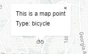

<h2 align="center"> Putting a mapbox map into an HTML template </h2>
<h3 align="center"> Part 2: Changing fonts </h3>


For this second exercise, we will be:
- adding popups to the map features
- adding a google font to the site
- using CSS to apply the font to various parts of the map and site


  Here are some additional resources you can explore:
  - [Maki-icons](https://labs.mapbox.com/maki-icons/){:target="_blank"} 


----------

### I. Getting setup  


1. 

----------

### II. Adding popups to the map

In order to add popups we need to specify the popup function for each of the layers.  We will do this within the forEach function that looks at each record in the geoJSON (` places.features.forEach(function (feature) {... }`), and within the if condition that checks the map or new icon types (`if (!map.getLayer(layerID)) {... }`).  

1. *Locate* the last line of within the scope of (`if (!map.getLayer(layerID)) {... }`).  It should be the checkbox's change funtion:
  ```javascript
     // When the checkbox changes, update the visibility of the layer.
     input.addEventListener('change', function (e) {
           map.setLayoutProperty(
               layerID,
               'visibility',
               e.target.checked ? 'visible' : 'none'
           );
      });
  ```
    
3. After this, add the following codeblock that will create variable that builds an HTML description for each point, gets the coordinates of each point, and then uses that description for the HTML of the popup that will open at the point's coordinates.
  ```javascript
     // When a click event occurs on a feature in the places layer, 
     // open a popup at the location of the feature, with description HTML from its properties.
     map.on('click', layerID, function (e) {
            var coordinates = e.features[0].geometry.coordinates.slice();
            var description = "This is a map point <br> Type: " + e.features[0].properties.icon;

            new mapboxgl.Popup()
            .setLngLat(coordinates)
            .setHTML(description)
            .addTo(map);
     });
  ```  
  <p align="center">
	     
  </p>
 
  
4. For an extra challenge, modify the text within the popup.

----------

### III. Changing the mouse symbol over points 

1. 

----------

### IV. Adding a font to the map

Assume a client has asked you to find a free to use "fun or whimsical" font for this map of sites in Washington D.C. In this

1. Visit https://fonts.google.com/ chose a "fun or whimsical" font, but make sure it is still legible. 
2. Get the HTML/CSS code by clicking "select this font"
3. Insert the html into the `<head>` of your site.
   e.g. If I picked Martel, I would insert the following code block. You should pick a different font, and you'll be asked to explain your choice for the assignment submission:
   ```html
      <!--   Link to google font-->
      <link rel="preconnect" href="https://fonts.gstatic.com">
      <link href="https://fonts.googleapis.com/css2?family=Martel&display=swap" rel="stylesheet">
   ```
4. Set the font for the legend "Filter-group":
   In the `<style>` section at the top, locate the class `.filter-group` and delete or comment out the current font `font: 12px/20px 'Helvetica Neue', Arial, Helvetica, sans-serif;`. Replace it with the font-family that you selected.
   e.g. If I picked Martel, the class `.filter-group` would look like this:
   ```css
       .filter-group {
        font-family: 'Martel', serif;
        font-weight: 600;
        position: absolute;
        top: 10px;
        right: 10px;
        z-index: 1;
        border-radius: 3px;
        width: 120px;
        color: #fff;
    }
   ```
   
4. Set the font for the popups:
   In the `<style>` section at the top, add a class `.mapboxgl-popup` with the font-family that you selected. Adjust the size of the font if yours feels too big, or too small. If I picked Martel, the new class would looke like this:
   ```css
    .mapboxgl-popup{
        font-family: 'Martel', serif;
        font-size: 150%;
    }   
    ```

