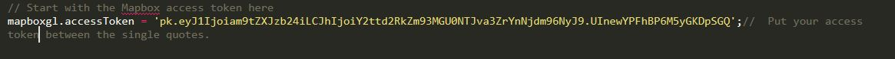
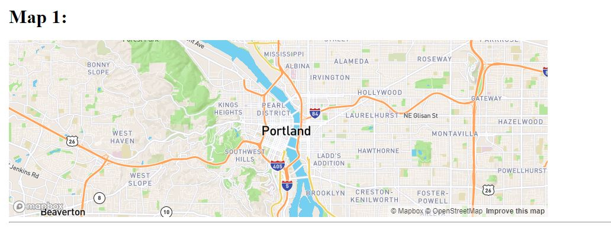
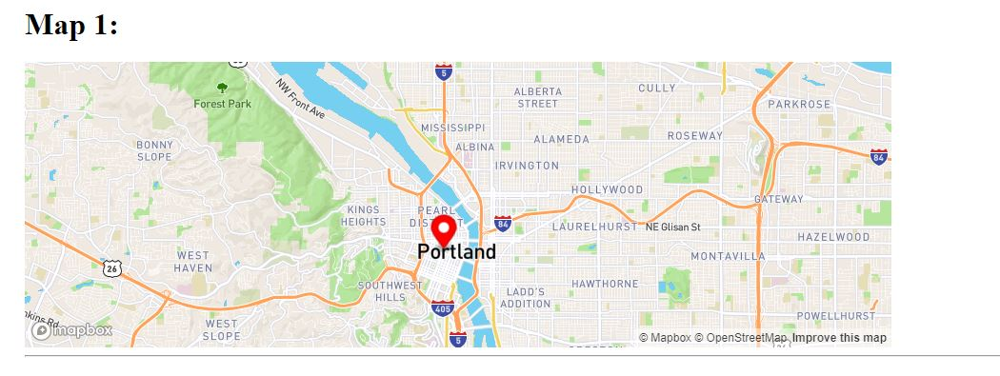

## Making Fixed and Fly-To Maps

Today we are going to make two different types of maps. The first will be fixed in place. It can't be panned or zoomed by the user, but is otherwise still and interactive map. The second will automatically fly-to predefined locations, guiding the user around.

### A. FIXED MAPS

### 1. Preparing your fixed map page

Start with the file `Fixed-structure.html` in the R-Drive Class_Data folder. Once again, you need to do the following preparation steps on your page (this time we are adding version 1.4.0):

1. Include Mapbox JavaScript file:

      ```html
            <script src='https://api.tiles.mapbox.com/mapbox-gl-js/v2.2.0/mapbox-gl.js'></script>
      ```
2. Include Mapbox CSS file __after__ Mapbox’s JavaScript:

      ```html
           <link href='https://api.tiles.mapbox.com/mapbox-gl-js/v2.2.0/mapbox-gl.css' rel='stylesheet' />
      ```

3. In the body, you'll add the [heading](https://www.w3schools.com/tags/tag_hn.asp) Map 1, a div element with the id "map1" where you want your first map to be, and a line or [horizontal rule](https://www.w3schools.com/tags/tag_hr.asp) below the map. Tip: Click the links to view the HMTL reference for these tags:

      ```html
      <h1> Map 1: </h1>
            <div id='map1'></div>
      <hr>
      ```

4. This time we will apply some CSS to specify an exact height and width for the map. This is particularly important for the map div, which *won't* show up on the page until you give it a height. Notice the css class for the map matches the ID of the map DIV (map1):

      ```css
              body { margin:50px; padding:0; }
              #map1 { position:relative; height:300px; width:50%;}
      ```

      This means the body div of your web page has a 50px margin around the edge, and the div with the ID "map1", will be 300px tall, and will take 50% of the width of your browser page.

      Now you’re ready to initialize the map and customize it.

### 2. Setting up the fixed map

Let’s create a map the centered on Portland with the Mapbox Streets style. Note: all the following code should be between script tags.

1. Add **your** access token, which gives you access to the mapbox API, access to styles associated with your account, and will track how many views your map has. Without this, the map will not work. 
      Remember, you can find your access tokens, create new ones, or delete existing ones on your [Access Tokens page](https://account.mapbox.com/access-tokens/) 

	```javascript
	mapboxgl.accessToken = 'pk.a...bunch..of..letters......'; //  Put your access token between the single quotes.
	```
	This is what mine looks like:

	<p align="center">
	    
	</p>

2. Next, initialize the map and set its view with specified coordinates and a zoom level.
 
      In the code block below, you will need to replace:
      1. the style URL, using 'mapbox://styles/mapbox/streets-v11' or check out the map [API](https://docs.mapbox.com/mapbox-gl-js/api/#map) to see more style options 
      2. the coordinates for the starting position. Use Portland, Oregon: [-122.6788, 45.5212]

      ```javascript
      var map = new mapboxgl.Map({
          container: 'map1', // id of a div on your page, where the map will be inserted
          style: 'set-the-style-here', // the style URL 'mapbox://styles/mapbox/streets-v11' 
          center: [set-the-lng, set-the-lat], // starting position [lng, lat] eg. [-122.6788, 45.5212]
          zoom: 11 // starting zoom 
      });
      ```

      <p align="center">
          
      </p>

**STOP:** Your map should be ready to take a look at. Open your `.html` file in a browser and take a look.
No map? There is likely an error in your code. Open your browser's Developer tools or Web Console to look for error messages.

Can you pan and zoom? Yes!? Great. Now, let's take that ability away.

### 3. Add a marker with a popup

Like last time, let’s add a marker to the same longitude/latitude that we centered our map on. Remember you can look at the [API](https://docs.mapbox.com/mapbox-gl-js/api/#marker) to see what marker options are available.

Add the script to inialize the popup and initialize a marker that uses that popup:

 ```javascript
                  var popup = new mapboxgl.Popup()
                      .setText('This is my first point.');

                  var marker = new mapboxgl.Marker({color:'red'})
                    .setLngLat([-122.6788, 45.5212]) // starting position [lng, lat]
                    .setPopup(popup) //add the popup named "popup" to this marker 
```

It should look like this:

<p align = "center">
	
</p>

### 4. Remove the map interactivity

Let's look at the map API again, specifically at the [interaction handlers](https://docs.mapbox.com/mapbox-gl-js/api/#user%20interaction%20handlers). Map objects have several interactivity handlers. We are going to disable them *all*.
1. After the map was initialized, add the following JavaScript code:

      ```javascript
                  // Disable drag and zoom handlers.
                  map.dragPan.disable();
                  map.scrollZoom.disable();
                  map.boxZoom.disable();
                  map.dragRotate.disable();
                  map.keyboard.disable();
                  map.doubleClickZoom.disable();
                  map.touchZoomRotate.disable();
                  map.touchZoomRotate.disableRotation();
      ```

Notice that each line starts with `map`, which is the variable name used when we initialized the map: `var map = new mapboxgl.Map(...`.

**STOP:** Test it out. Can you pan and zoom anymore? Nope. Can you still click on the marker to open the popup? Success, a fixed, interactive map!

### 5. Add a second map

To add a second map to your page. You have to add a div to the structure of your page, use CSS to make sure the map has some height, initialize the second map, create another pop-up and marker, and disable the interactivity for the second map as well. We will use `map2` for both the div ID and the map object variable name. 

Below the `<HR>`, add another heading and div:
```html
        <h1> Map 2:</h1>
        <div id='map2'></div>
```
In the head, stlye section, add CSS to stlye the second map:
```css
#map2 { position:relative; height:300px; width:50%;}
```
Below the other JavaScript, initialize the 2nd map:
```javascript
            // Then initialize the 2nd map
            var map2 = new mapboxgl.Map({
                container: 'map2', // id of a div on your page, where the map will be inserted
                style: 'mapbox://styles/mapbox/streets-v11', // stylesheet location
                center: [-122.6588, 45.1212], // starting position [lng, lat] eg. [-122.6788, 45.5212]
                zoom: 11 // starting zoom 
            });
```    
Add a marker:
```javascript
            var popup2 = new mapboxgl.Popup()
                .setText('This is my second point.');

            var marker2 = new mapboxgl.Marker({color:'blue'})
              .setLngLat([-122.6588, 45.1212]) // starting position [lng, lat] 
              .setPopup(popup2) //add the popup to the marker 
              .addTo(map2);
```
Disable the map interactivity. Notice we are disabling interactivity on **map2**:
```javascript        
            // Disable drag and zoom handlers. 
            map2.dragPan.disable();
            map2.scrollZoom.disable();
            map2.boxZoom.disable();
            map2.dragRotate.disable();
            map2.keyboard.disable();
            map2.doubleClickZoom.disable();
            map2.touchZoomRotate.disable();
            map2.touchZoomRotate.disableRotation();
```
<p align = "center">
    
 </p>

**Congratulations!** You've made a webpage with two static maps! _For your assignment, you'll have to add a third map._


### B. Fly-To Maps

### 1. Open the fly-to map page

Let's start with the file `Activity2-Fixed-and-Fly-To-Maps\Fly-to-ONCE.html` in the R-Drive Class_Data folder. 
Open it in a browser. Click on the button and watch as we fly from Los Angeles, CA to Austin, TX.

Now open and examine `Activity2-Fixed-and-Fly-To-Maps\Fly-to-ONCE.html` in your text editor.

First, notice the usual code for our map:
 - References to the Mapbox CSS and JS are included in the head.
 - A DIV for the map
 - CSS style defiens the map's size
 - A mapbox access token is included
 - The map is initialized
 - A popup is initialized
 - A marker, using the popup, is added to the map

Notice the CSS that was used to style the button:
```CSS
        /* The CSS for the "Fly" button  */
        #fly {
            display: block; /* displays over the map */
            position: relative; /* displays over the map */
            margin: 0px auto; 
            width: 50%;
            height: 40px;
            padding: 10px;
            border: none;
            border-radius: 3px; /* rounded corners */
            font-size: 12px;
            text-align: center;
            font-weight: bold;
            color: oldlace;
            background: DarkRed;
        }
  ```
  
  Try changing the button width and color: Make the button only 30% width. Make the button "forestgreen".
  
  
### 2. Examine the flyto script
 
 Look at the bottom of  the JavaScript section. 
 
 First, we search the DOM for an element with the ID 'fly'. That's the button div!
 We added a 'click' listener, so if you click the div, something happens. In this case, we call the function "flyTo" on our map. Open [flyTo in the Mapbox API](https://docs.mapbox.com/mapbox-gl-js/api/#map#flyto).  
 
Notice there are multiple options we can set. Including: center, zoom, speed, curve.
Right now we only set the center. I have options for the zoom and speed commented out.

 ```javascript
         // add a 'Listener' to the div with the ID 'fly', that's the button.
       document.getElementById('fly').addEventListener('click', function () {
            map.flyTo({
                center: [-97.70,30.30], //new center.
//                zoom: 9,
//                speed: 0.2
            });
        });
```

Try un-commenting the zoom option. See how that changed the effect. Try a few different values. You can see how the final zoom changes.
Try un-commenting the speed option. See how that changed the effect. Try a few different values. You can see how the speed of the "fly" changes.

Comment out the zoom and speed options.
Now scroll up in the API, there is another function called "jumpTo". Let's try changing the function to "jumpTo" as below:


 ```javascript
         // add a 'Listener' to the div with the ID 'fly', that's the button.
       document.getElementById('fly').addEventListener('click', function () {
            map.jumpTo({
                center: [-97.70,30.30], //new center.
//                zoom: 9,
//                speed: 0.2
            });
        });
```

What was the difference? You'll have to explain the difference in your assignment.

**Congratulations!** That is it for today's activity. Please proceed to the assignment on canvas for details on what to turn in.

Once you have completed your assignment, open and examine `Activity2-Fixed-and-Fly-To-Maps\Fly-to-many.html` in your text editor and browser. This version uses an array to keep track of multiple locations that we can fly to when the button is clicked. Each click iterates through the lng/lat pairs in the array.
