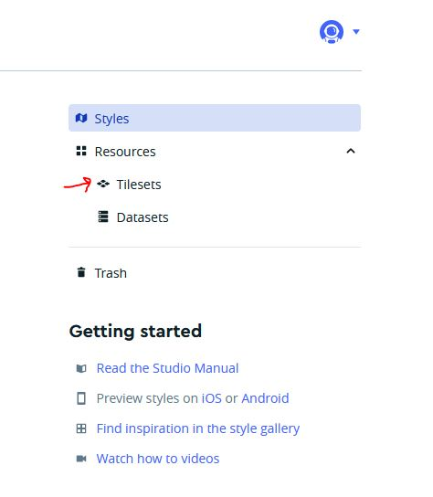
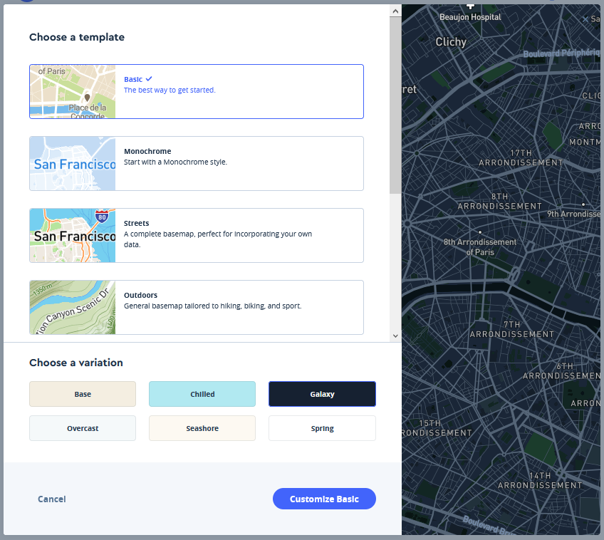
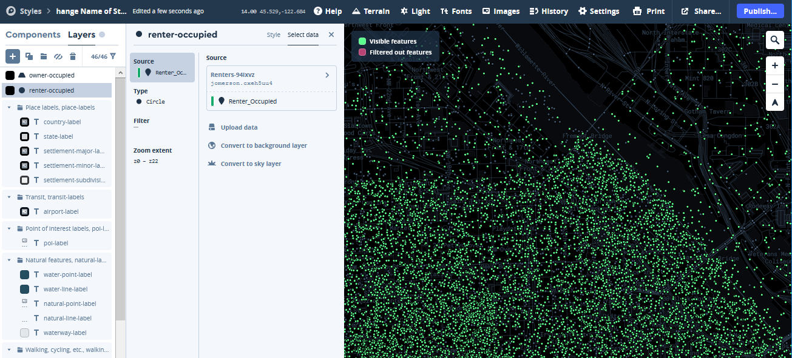
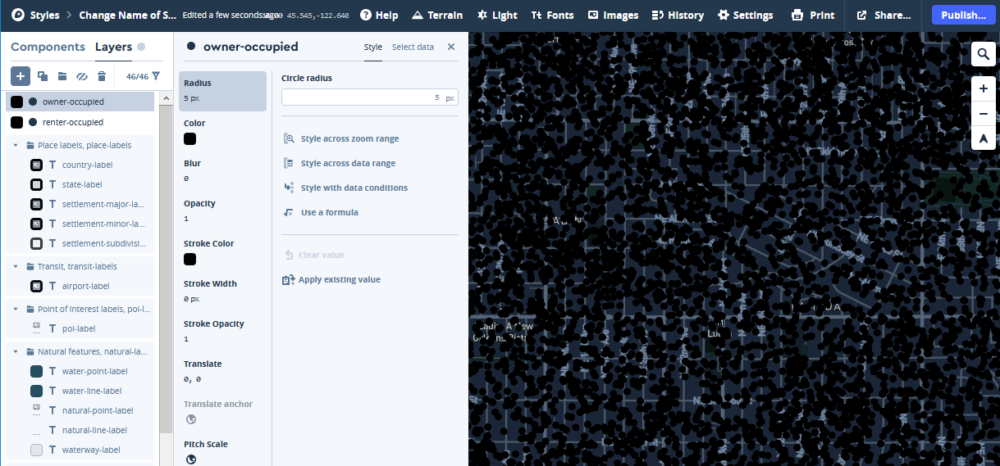
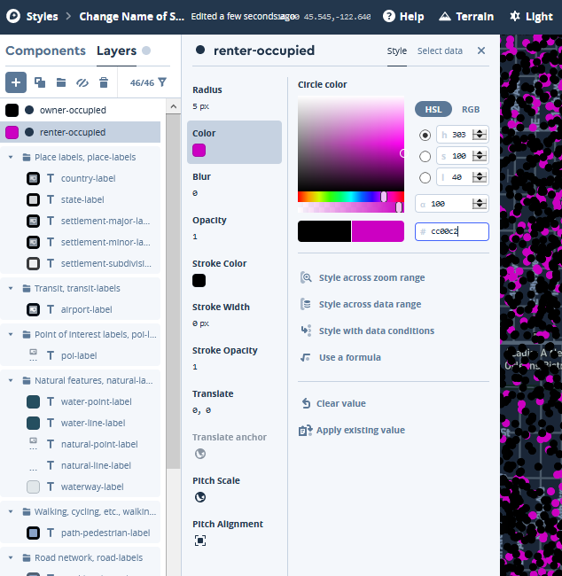
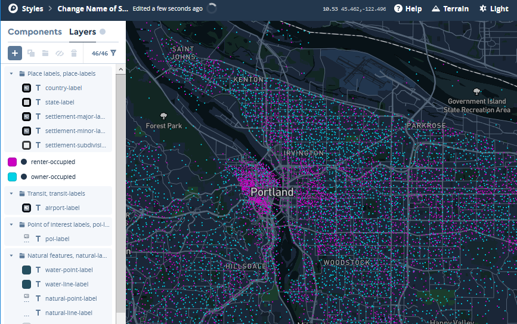
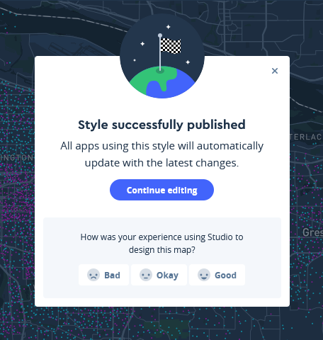

<h2 align="center"> Mapping renters vs owners in Portland </h2>
<h3 align="center"> Part I: Creating a map style in Studio </h3>

The US Census makes owner/renter information readily available for census block geometries, in this lab series we are going to view the owner/renter information in different ways: 

1) Mapping the per-person level information as a dot density map, and 
2) Viewing the relative incidence of owners to renters using a choropeth map. 

For this first exercise, we will be creating a dot density map that displays the each individual renter and owner in Portland by block group. 

### In this tutorial you will:

- [Create a style](https://www.mapbox.com/help/how-map-design-works/#how-map-styles-work) for a basemap for a dynamic, [interactive web map or app](https://www.mapbox.com/help/how-web-apps-work/)
- [Manage and edit layers](https://www.mapbox.com/studio-manual/reference/styles/#style-editor) in your style
- [Add data](https://www.mapbox.com/help/uploads/) to a style
- Make [beautiful custom styles](https://www.mapbox.com/designer-maps/)
- Use [dynamic styling rules](https://blog.mapbox.com/studio-expressions-design-81012e2dab55) (e.g. based on zoom level, based on field in the data etc.)

----------

### Data

The data are provided as [MBTiles](https://docs.mapbox.com/help/glossary/mbtiles), but you could also upload shapefiles or JSON files.

- [Portland renters by block group 2017](Data/Renters.mbtiles) - [Source: US Census](https://factfinder.census.gov/faces/nav/jsf/pages/index.xhtml) 

- [Portland homeowners by block group 2017](Data/Owners.mbtiles) - [Source: US Census](https://factfinder.census.gov/faces/nav/jsf/pages/index.xhtml) 

----------

### Uploading data to Studio

To add the renter data to a style in Mapbox Studio, you need to upload it to your account. Go to your [**Tilesets**](https://www.mapbox.com/studio/tilesets) [page](https://www.mapbox.com/studio/tilesets) in Mapbox Studio to upload your *renter* data.

<p align="center">
  
</p>


<br>
Next, upload your *owner* data to Mapbox. 

----------

### Create a new style 

After you've uploaded your data, it's time to create a new "style" so you can put it on the map! Go to your [Styles page](https://www.mapbox.com/studio/). Click the **New style** button. Find the *Dark Template* style and click **Customize Dark**.

<p align="center">
  
</p>

Rename the style so that you can find it later: click into the title field in the upper left side of the screen to change the title from "Dark" to ‘Renters vs Owners’.

<p align="center">
  
</p>
  

*You can always refer to the* [*Mapbox Studio Manual*](https://www.mapbox.com/studio-manual/reference/styles/) *for more information on working with styles.*

----------

### Add a new layer

To add and symbolize your data, you will need to add a **new layer** to the map. At the top of the layer panel, click **+ Add layer** and select your **renter** layer that you just uploaded as a tileset. 

The editor is now showing your map in “x-ray mode.” X-ray mode shows all the data in the sources added to the style, regardless of whether there is a layer to style it.

In the *New layer* panel, look in the list of *Data sources* for the **owner** source. Click the tileset and then select the source layer as the source for this new style layer.


The default Basic map view is not centered on the United States. Mapbox Studio recognizes that the data you have uploaded is focused on a different location, so it displays the message *"This tileset isn't available from your map view."* Click **Go to data**, and the map view will refocus on the United States.

Your new layer will be highlighted on the x-ray map. If it doesn't look like the image below, you may need to change the "Type" to "Circle".

<p align="center">
  
</p>


Click the **Style** tab and the map will switch back to style mode displaying your new layer. You will see the state data on the map with a default style (black with 100% opacity).


<p align="center">
  
</p>


You can rename the layer by clicking on the name of the layer at the top of the panel. 

At this point you should have added both the renter-occupued and owner-occupied tilesets to your "Owners vs Renters" styles and both should have the "type" circle.

----------

### Symbolize or "style" the layer

Each layer in Studio can be styled individually by clicking on the name of the layer in the Layer list. There are several layer types to choose from. Each layer type has a unique set of layer properties that can be specified. There are a few options for specifying property values. You can pick values individually, based on a data attribute, based on the zoom level, or the value of another property. For more information on layer types and their styling rules check out this [reference guide](https://docs.mapbox.com/studio-manual/reference/styles/).

In the Mapbox Studio style editor, you can assign a color to each of your layers. Click the Style link in the **renters** layer. Next, click **color** and change the hex color value (after the '#') to #cc00c2 (bright blue).

<p align="center">
  
</p>
  
 Next, click the Style link in the **owners** layer and change the hex color value (after the '#') to a  #00d2e6 (bright pink). 

----------

### Data driven style

In the Mapbox Studio style editor, you can assign a radius size value to each layer based on its zoom level. Click the Style link in the **renters** layer. Next, click **Style across zoom range**. We'll talk more about why we do this during the upcoming Scale lecture.

The rate of change is set to **Linear**. Click **Edit** and select **Exponential** instead. Click **Done**. Since you have set the rate of change to step, the colors for each range of density between stops will be uniform.

Now it's time to start adding stops and radius sizes! You will create several stops in order to make your layers visible at multiple zoom levels. Click on **Edit** in the first zoom level stop. 

Change zoom value of the first stop to 12, and change the radius size to **1.5**.  Click **Done**.

<p align="center">
  
</p>
  
  
Click **+ Add another stop**. Assign the zoom level to 15, and change the radius size to **1.58**. Click **Done**. 
Create the following additional stops:

| Zoom Level | Value   |
|------------|---------|
| 16         | 2.5     |
| 17         | 3.95    |
| 18         | 6.25    |
| 19         | 9.88    |
| 20         | 15.63   |
| 21         | 24.71   |
| 22         | 39.06   |


As you start adding stops, you will see the map change on the right to reflect the new stops. In this case, you will notice the size of the **renters** layer changing as you zoom in and out of the map. 


### Style your owner data layer

We want to apply the same styling rules that we just assigned to our **renters** layer to our **owners** layer. Instead of inputting all of the values that we just added to our **renters** layer, we can simply copy the rules that wecreated into our **owners** layer. It is stored as "JSON" code.

Click the Style link in the **renters** layer. Next, click on **radius** and find the JSON editor symbol ```</>```. Select the JSON editor and copy the code OR copy the code written below. 

```javascript
[
  "interpolate",
  ["exponential", 1],
  ["zoom"],
  12,
  1.5,
  15,
  1.58,
  16,
  2.5,
  17,
  3.95,
  18,
  6.25,
  19,
  9.88,
  20,
  15.63,
  21,
  24.71,
  22,
  39.06
]
```

Navigate to your **owners** layer and select **radius**. Paste the styling rules into the JSON editor of this layer. You should see these changes immediately. 

<p align="center">
  
</p>


----------


### Reorder your layers

<p align="center">
  
</p>

One of the most powerful things about the Mapbox Studio style editor is that you can reorder any of the elements of the map. Notice in the photo above that we moved the settlement-labels to the top of the layer list. This puts the labels from the basemap on top of the data that you've added to the standard map layers.

To make your map match the example above, move your **settlement-label** to the top of your layer list.

----------


### Publish the style


Now that you've got your map looking good, it's time to publish your "Style" so that it can be viewed on the web! Click the **Publish style** button at the top of the toolbar on the right side of the screen, then click **Publish** again on the next prompt.

<p align='center'>
  
</p>

Hooray! Your style is now published. If you go back to your Styles page, you will see your new style at the top of the list.
You can use your ‘Share URL’ to open your style in a new browser tab and share it with collaborators for review.

----------

### Next steps

Head to [part 2](02-Population-Points.md) to learn how add interactive elements to your map and publish it to the web with Mapbox GL JS. 


