<h2 align="center"> Custom data in an interactive map in mapbox </h2>
<h3 align="center"> Mapping renters vs owners in Portland </h3>
<h3 align="center"> Part I: Creating a map style in Studio </h3>

The US Census makes owner/renter information readily available for census block geometries, in this lab series we are going to view the owner/renter information in different ways: 

1) Mapping the per-person level information as a dot density map, and 
2) Viewing the relative incidence of owners to renters using a choropleth map. 

For this first exercise, we will be creating a dot density map that represents each individual renter and owner in Portland by block group. 

### In this tutorial you will:

  - Upload data 
  - Add data, as a layer, to a basic style
  - Set dynamic styling rules (e.g. based on zoom level, based on field in the data etc.)
  - Manage and edit layers in your style

**Important note - Spring 2026:** in many of the screenshots below, you may have fewer layers visible. Mapbox recently hid more of the basemap layer styling away from us. That's okay. We are going to focus on the data-driven symbology of the two thematic layers and will get more into basemap symbology later in the term.


  Here are some additional resources you can explore:
  - [Map design and styles](https://docs.mapbox.com/help/dive-deeper/map-design/){:target="_blank"} 
  - [Web applications](https://docs.mapbox.com/help/dive-deeper/web-apps/){:target="_blank"}
  - [Style editor](https://www.mapbox.com/studio-manual/reference/styles/#style-editor){:target="_blank"} in your style
  - [Uploading data](https://docs.mapbox.com/help/troubleshooting/uploads/){:target="_blank"}
  - [More powerful styling in Studio](https://blog.mapbox.com/studio-expressions-design-81012e2dab55){:target="_blank"} (e.g. based on zoom level, based on field in the data etc.)

----------

### I. Data

  The data are provided as [MBTiles](https://docs.mapbox.com/help/glossary/mbtiles){:target="_blank"}, but you in general could also upload shapefiles or JSON files to style in Mapbox Studio.


1. Download the following 2 tilesets:
  - Portland **renters** by block group 2017: [Download](Data/Renters.mbtiles) 
  - Portland **homeowners** by block group 2017: [Download](Data/Owners.mbtiles)  
    Source: [US Census](https://data.census.gov){:target="_blank"}, then processed in QGIS to produce randomized points per tract. 
 
 2. Note where it saved (e.g. your downloads folder)

----------

### II. Uploading data to Studio

To add the data to a style in Mapbox Studio, you need to upload it to your account. 
1. Login to [mapbox studio](https://studio.mapbox.com/){:target="_blank"}
    Notice the buttons on the left "Style Editor", "Data Manager", you'll be navigating through each of these.
    <p align="center">
      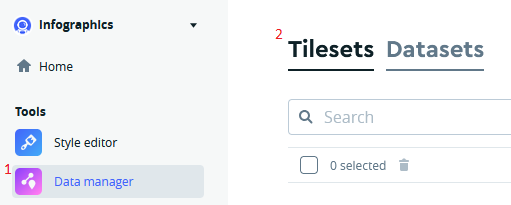
    </p>

2. Click **Data manager** then you should be on the **Tilesets** page
3. Upload your **owner** data to Mapbox, by clicking the blue button **New tileset**
4. Drag and drop the Owners.mbtiles file into the site or click "Select a file" and browse to it  

   *Note 1*: you are limited to 20 uploads / month via this drag and drop method. If you need to upload more than that, you can do so via methods that we won't be covering in class.
   
   *Note 2*: these are pretty big files, so depending on your internet connection this may take a minute or two.
6. Upload your **renter** data to Mapbox, by again clicking the blue button **New tileset**
7. Drag and drop the Renters.mbtiles file into the site or click "Select a file" and browse to it

----------

### III. Create a new style for your data

After you've uploaded your data, it's time to create a new "style" so you can put it on the map!  

Close any popups and notifications about tours and new features. You can view those later if you'd like. *You can always refer to the* [*Mapbox Studio Manual*](https://www.mapbox.com/studio-manual/reference/styles/) *for more information on working with styles.*

1. Go to your **Style Editor** page (menu button on the left).
   <p align="center">
      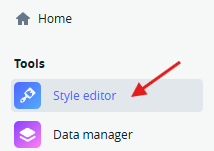
    </p>
3. Then click the blue **New style** button.
4. You can choose from different styles which contain different color presets. For this "dark mode" map, select Basemap: **Standard**, Color theme: **Monochrome**, and Light process: **Night**.
5. Click "Monochrome"
   <p align="center">
      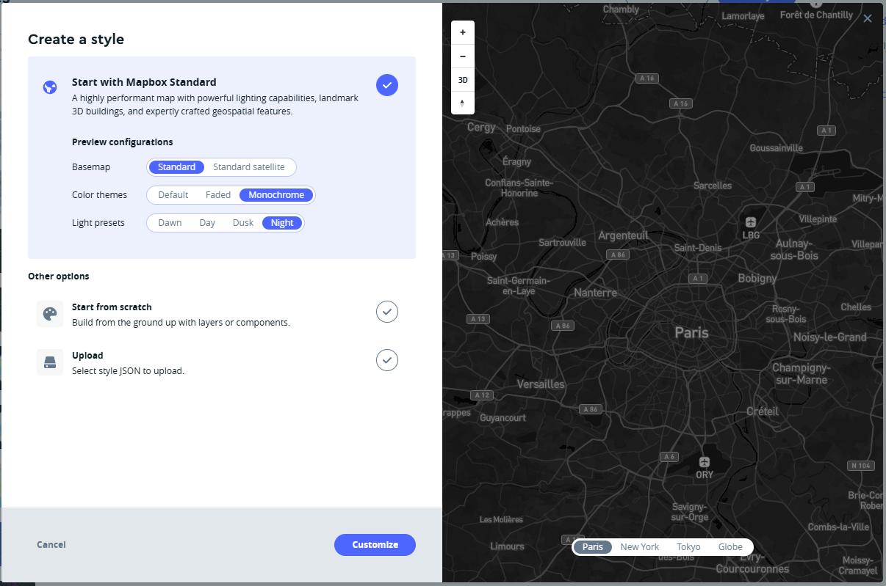
    </p>
6. Rename the style so that you can find and use it later: click into the title field in the upper left side of the screen to change the title from "Untitled" to ‘Renters vs Owners’.

    <p align="center">
      
    </p>

----------

### IV. Add a new layer

1. To add and symbolize your data, you will need to add it as a new layer to the style. On the **Layers** panel, click the blue **+** button then **Custom layer** to add a new layer.
2. From the **Source** menu, and find and select the **renter** layer that you uploaded as a tileset. 
    <p align="center">
      
    </p>

3. A popup may tell you the data isn't visible in your current view. click **Go to data** to quickly pan to the data in Portland.  

4. The editor is now showing your map in “x-ray mode.” X-ray mode shows all the data in the sources added to the style, regardless of whether there is a layer to style it.

    Your new layer will be highlighted on the x-ray map. If you don't see tiny green dots like the image below, you may need to change the "Type" to "Circle".
    Note: your dots may appear larger, and you may have fewer layers in your layer-list. That's okay.

    <p align="center">
      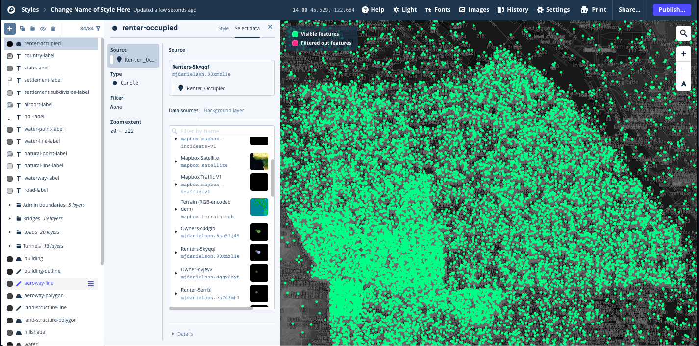
    </p>

6. Now repeat 2-4 to add the owner data: Use the Add layer button blue **+**, click custom layer. In the *New layer* panel, use "Source" ">" to look in the list of sources for your **owner** source. Click the tileset and then select the source layer as the source for this new style layer.


7. Click the **Style** tab and the map will switch back to style mode displaying your new layers. You will see the population point data on the map with a default style (black with 100% opacity, so it might be hard to see on the dark background).

    <p align="center">
      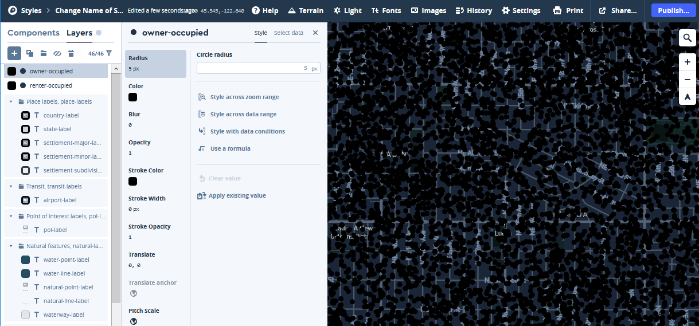
    </p>


8. Rename the layers "Owners" and "Renters" by clicking on the name of each layer at the top of the panel.
    <p align="center">
      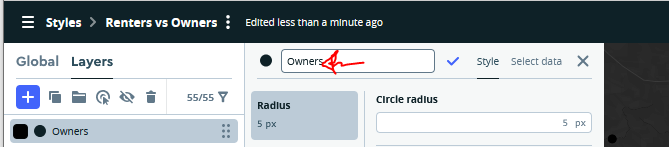
    </p>

   
STOP: Okay... let's review. At this point you should have added both the renter‑occupied and owner‑occupied tilesets to your "Owners vs Renters" style and both should have the "type" circle and should be renamed.

----------

### V. Symbolize or "style" a layer

Each layer in Studio can be styled individually by clicking on the name of the layer in the Layer list. There are several layer types to choose from. Each layer type has a unique set of layer properties that can be specified. There are a few options for specifying property values. You can pick values individually, based on a data attribute, based on the zoom level, or the value of another property. For more information on layer types and their styling rules check out this [reference guide](https://docs.mapbox.com/studio-manual/reference/styles/).

1. Here in the Mapbox Studio style editor, you can assign a color to each of your layers. Click the Style tab in the **renters** layer. 
2. Click **Color** and change the color mode to **HEX**, then set the hex color value (after the '#') to #cc00c2 (bright pink).
3. Change the **Emissive strength** to 1

    <p align="center">
      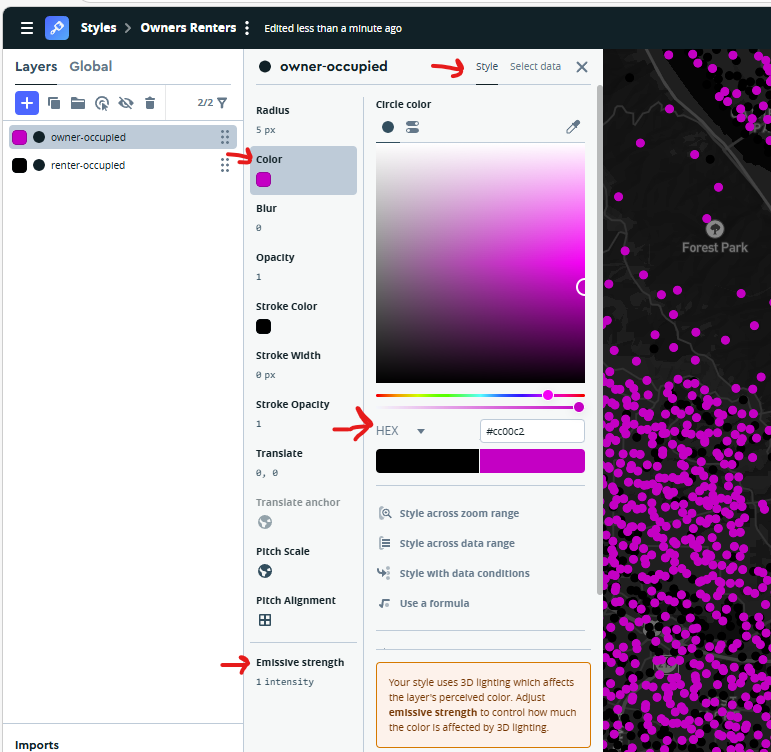
    </p>

 4. Next, click the Style link in the **owners** layer and change the hex color value (after the '#') to a  #00d2e6 (bright blue), and the **Emissive strength** to 1. 

----------

### VI. Data driven style

In the Mapbox Studio style editor, you can assign a radius size value to each layer based on its zoom level. 

1. Click the Style tab in the **renters** layer and click on **Radius** Next, click **Style across zoom range**. We'll talk more about why we do this during the upcoming Scale lecture.

2. The rate of change is set to **Linear**. Click it and select **Exponential** instead. Now it's time to start adding stops and radius sizes! You will create several stops in order to make your layers visible at multiple zoom levels. 
 
3. Change zoom value of the first stop to 12, and change the radius size to **1.5px**.

4. Assign the zoom level of the second stop to 15, and change the radius size to **1.58**.
<p align="center">
      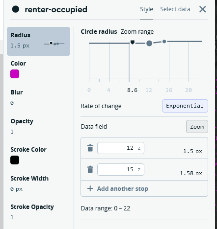
    </p>
5. Click Add another stop and one-by-one create the following additional stops:

    | Zoom Level | Value   |
    |------------|---------|
    | 16         | 2.5     |
    | 17         | 3.95    |
    | 18         | 6.25    |
    | 19         | 9.88    |
    | 20         | 15.63   |
    | 21         | 24.71   |
    | 22         | 39.06   |


As you start adding stops, you will see the map change on the right to reflect the new stops. This is what the radius setting will look like when you are done:


  <p align="center">
    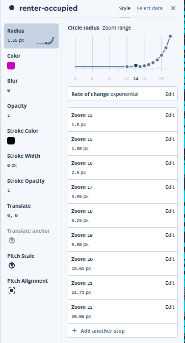
  </p>

Now, scroll in and out on the map. Notice the size of the **renters** layer circle symbols change pixel size as you zoom in and out of the map. The current zoom level is shown in the bottom left of your window AND in the dynamic graph at the top of the circle radius Style panel. 

### VII. Style your owner data layer

We want to apply the same styling rules that we just assigned to our **renters** layer to our **owners** layer. Entering the stops manually was tedious. Instead we just added to our **renters** layer, we can simply copy the rules that we created into our **owners** layer. It is stored as "JSON" code.

1. Click the Style link in the **renters** layer. Next, click on **radius** and find the JSON editor symbol ***</>***. Select the JSON editor and copy the code OR copy the code written below. 

    ```javascript
    [
      "interpolate",
      ["exponential", 1],
      ["zoom"],
      12,
      1.5,
      15,
      1.58,
      16,
      2.5,
      17,
      3.95,
      18,
      6.25,
      19,
      9.88,
      20,
      15.63,
      21,
      24.71,
      22,
      39.06
    ]
    ```

2. Navigate to your **owners** layer and select **radius**. Paste the styling rules into the JSON editor of this layer. You should see these changes immediately. Zoom in and out to see your handywork! The dots' pixel size will adjust as you zoom in and out.

    <p align="center">
      
    </p>


----------


### VII. Reorder your layers

One of the most powerful things about the Mapbox Studio style editor is that you can reorder any of the elements of the map. Mapbox uses three "slots" to help with layer organization.
 
 1. not specified: If there is no identifier, the new layer will be placed above all existing layers in the style
 2. top: Above POI labels and behind Place and Transit labels. Note that the top slot is designed to be used with the symbol layers
 3. middle: Above lines (roads, etc.) and behind 3D buildings
 4. bottom: Above polygons (land, landuse, water, etc.)


To move the data layers below labels:
  1. click and drag the **renters** layer into the middle slot
  2. click and drag the **owners** layer into the middle slot


  <p align="center">
    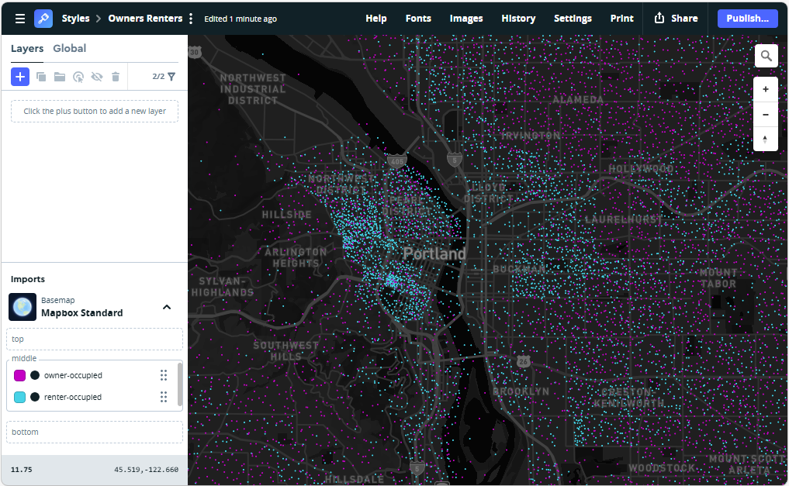
  </p>

----------


### IX. Publish the style


Now that you've got your map looking good, it's time to publish your "Style" so that it can be viewed on the web! 

1. Click the **Publish...** button at the top of the toolbar on the right side of the screen, then click **Publish** again on the change preview prompt.

    <p align='center'>
      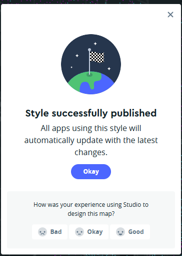
    </p>

Hooray! Your style is now published. If you go back to your Styles page, you will see your new style at the top of the list.

You can use your ‘Share URL’ to open your style in a new browser tab and share it with collaborators for review, or you can use the **style URL** to embed it in a map using JavaScript.

<p align='center'>
      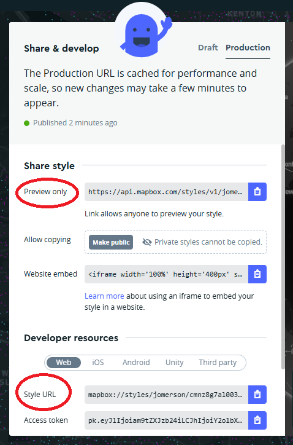
</p>


----------

### X. Next steps
Next, complete [Part II](https://jmersonuo.github.io/Activities/Population-Tutorial/02-Population-Points) to set up a webmap, add interactive elements to the map, and publish it to the web with Mapbox GL JS. 


