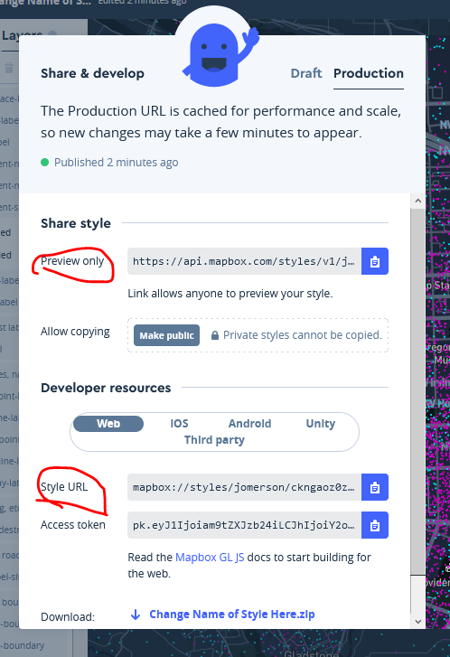
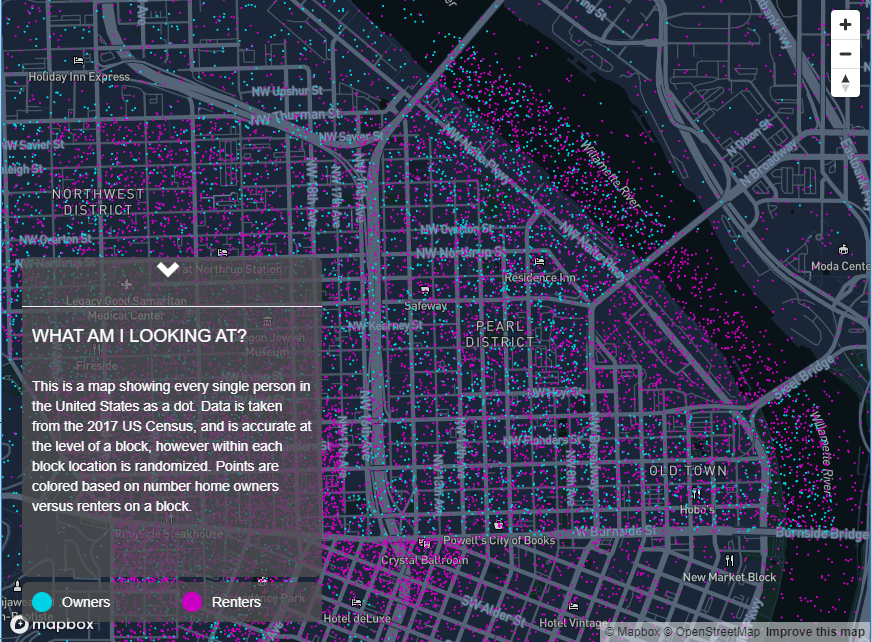

<h2 align="center"> Mapping renters vs owners in Portland </h2>
<h3 align="center"> Part II: Adding interactivity to web maps through GL-JS </h3>


### In this tutorial you will:

- Learn about GL-JS and adding interactivity
- Add map elements using mapbox  GL-JS
- Style page elements using CSS
- Add interactivity using JavaScript


A few additional resources for Mapbox GL JS:

- [https://www.mapbox.com/mapbox-gl-js/api/](https://www.mapbox.com/mapbox-gl-js/api/){:target="_blank"}
- [https://www.mapbox.com/mapbox-gl-js/examples](https://www.mapbox.com/mapbox-gl-js/examples){:target="_blank"}
- Example finished maps that use Mapbox GL JS for more design control and interactivity: 
    - [https://native-land.ca/](https://native-land.ca/){:target="_blank"} 
    - [https://www.mapbox.com/amnesty/](https://www.mapbox.com/amnesty/){:target="_blank"} 
    - [https://www.nytimes.com/interactive/2018/upshot/election-2016-voting-precinct-maps.html](https://www.nytimes.com/interactive/2018/upshot/election-2016-voting-precinct-maps.html){:target="_blank"} 
- This exercise is based on: [https://docs.mapbox.com/help/tutorials/choropleth-studio-gl-pt-2/](https://docs.mapbox.com/help/tutorials/choropleth-studio-gl-pt-2/){:target="_blank"} 


----------

### I. Setting up your HTML page


To begin, we will be using a sample code to initialize a simple web map. 
1. Create a new folder for this assignment on your *R-drive*. 
2. Create a new file called `index.html` and copy the code below.

    Note that is contains the standard sections:  
        - `HMTL` containing everything else  
        - `head` containing a title (text in the bowser tab), links to the mapbox JS and CSS libraries, and *new* library we have not used yet called [Boostrap](https://www.w3schools.com/whatis/whatis_bootstrap.asp){:target="_blank"}. Boostrap is a CSS Framework for developing responsive websites and we'll explore it when get more into layout.  
        - `style` within the `head`  
        - `body` which contains a `div` for the map, and a `script` section.  

    ```html
    <!DOCTYPE html>
    <html>
    <head>
        <meta charset='utf-8' />
        <title>Owners vs Renters Map</title>
        <meta name='viewport' content='initial-scale=1,maximum-scale=1,user-scalable=no' />
        <link href="https://maxcdn.bootstrapcdn.com/bootstrap/3.3.7/css/bootstrap.min.css" rel="stylesheet" integrity="sha384-BVYiiSIFeK1dGmJRAkycuHAHRg32OmUcww7on3RYdg4Va+PmSTsz/K68vbdEjh4u" crossorigin="anonymous">
        <script src='https://api.tiles.mapbox.com/mapbox-gl-js/v2.2.0/mapbox-gl.js'></script>
        <link href='https://api.tiles.mapbox.com/mapbox-gl-js/v2.2.0/mapbox-gl.css' rel='stylesheet' />
        <style>
            body { margin:0; padding:0; }
            #map { position:absolute; top:0; bottom:0; width:100%; }
        </style>
    </head>
    <body>

      <div id='map'></div>
      <script>
        mapboxgl.accessToken = 'ACCESS TOKEN GOES HERE'; 
        var map = new mapboxgl.Map({
            container: 'map', // container id
            style: 'STYLE URL GOES HERE', // stylesheet location
        });
      </script>

    </body>
    </html>
    ```


3. Edit the code to add your Mapbox [access token](https://www.mapbox.com/help/define-access-token/) in the section that says "ACCESS TOKEN GOES HERE". Remember, you can get your access token from your Mapbox [‘Account’ page](https://account.mapbox.com/)).

----------

### II. Adding your custom style

1. To load the style that you created in the Part I, you need to go to go your Mapbox Studio account and copy the Style URL:

    <p align="center">
        
    </p>
    <br>
    <h3 align ="center"> OR </h3>
    <br>
    <p align="center">
        
    </p>

2. Paste your style URL into your code where the map is initialized in the JavaScript.
    Now preview it in a browser to view your changes. Is is blank? Did you add _your_ mapbox token and __your__ style URL? Any errors in the browser console?
    <p align="center">
        
    </p>

----------

## III. Add navigation controls

Let’s try modifying the code to add a new **element** to the map. Currently, you can zoom in and out using your mouse, but we want to add navigation **controls** (zoom in, zoom out, and north arrow) to make the zooming functions more obvious to our end users.

1. Look at this mapbox example: [https://www.mapbox.com/mapbox-gl-js/example/navigation/](https://www.mapbox.com/mapbox-gl-js/example/navigation/){:target="_blank"}

    What part of the example is missing for your current code? The **NavigationControl**! 
    
2. Add the navigation control function into your code below your map variable. This goes before the closing `</script>` tag. Pay attention to the whitespace as you add new code. Keep the whitespace and alignment neat!

    ```javascript
    // Add zoom and rotation controls to the map.
    map.addControl(new mapboxgl.NavigationControl());
    ```

    `map.addControl...` adds the map control to the element with variable name "map" using the "dot operator". If you were to add it to a different map, you'd have to adjust the name before the period or "dot". e.g. `map2.addControl...`
    
    Preview it in the browser when you have finished. See the nav controls on the top right?

3. Are you a skilled programmer? look in the API reference for [nagivgation control](https://docs.mapbox.com/mapbox-gl-js/api/#navigationcontrol){:target="_blank"} to see how to move the control to the `top-left`.

    _Hint:_ The example in the documentation adds the control in two lines, whereas we had previously added it in one line. 


----------

### IV. Adding a dynamic legend

The following code adds the *styling rules* that will be style the DOM elements that show the legend for the map. 

1. This is CSS (cascading style sheets) code, so it goes in the `style` section. Copy and paste the following just after the opening ``<style>`` tag in the `<head>` of your code: 

    ```css
          /*  stlye for paragraph tags */
          p {
            color: white; 
          }

          /* style for heading level 4 tags */
          h4 { 
            color: white;
            margin-left: 10px;
          }

          /*  style for items with the class "LegendContainer" */
          .LegendContainer {
            position: absolute;
            bottom: 20px;
            left: 20px;
            z-index: 2;
            width: 300px;
            height: 40px;
            background: rgba(80, 80, 80, .75);
            transition: width 2s, height 2s;
            border-radius: 7px;
          }

          /*  style for items with the class "descriptionPanel" */
          .descriptionPanel {
            position: absolute;
            bottom: 65px;
            left: 20px;
            z-index: 2;
            width: 300px;
            height: 40px;
            background: rgba(80, 80, 80, .75);
            transition: width 2s, height 2s;
            overflow: hidden;
            border-radius: 7px;
          }

          /*  style for items with the class "descriptionPanel" when active */
          .LegendContainer:active {
            width: 240px;
            height: 250px;
          }

          /* style for items with the class "legendItem" */
          .legendItem {
            float: left;
            width: 50%;
            margin-top: 10px;
            margin-bottom: 10px;
          }

          /* style for items with the class "colorBox" */
          .colorBox {
            width: 20px;
            height: 20px;
            float: left;
            border-radius: 10px;
            margin-left: 10px;
          }

          /* style for items with the class "layerDescription" */
          .layerDescription {
            color: white;
            float: left;
            margin-left: 10px;
          }

          /* style for items with the class "chevron" */
          .chevron {
            position: relative;
            margin-left: 45%;
            font-size: x-large;
            color: white;
          }

    ```

2. Next, we will need to add a container to display background information about our map and data sources. Add a new DIV container to your DOM by adding this code below the _map_ DIV. It is `HTML` so, don't add in between the `script`tags. That's for JavaScript. 
    
    ```html
         <div class="descriptionPanel" id="descriptionPanel" style="height: 320px;">
            <span onClick=panelSelect() id="glyph" class="chevron glyphicon glyphicon-chevron-down"></span>
            <hr />
            <h4>WHAT AM I LOOKING AT?</h4><br />
            <p style="margin-left: 10px; margin-right: 10px;">
            This is a map showing every single person in the United States as a dot. Data is taken from the 2017 US Census, and is accurate at the level of a block, however within each block location is randomized. Points are colored based on number home owners versus renters on a block.
            </p>
         </div>
    ```
4. Add a comment above this div explaining what it is. (e.g. /* map description panel */).

    *Notice* that the specification for the div with the `class=descriptionPanel` was defined in the CSS. Classes in CSS start with a `.`:
    
    FIND THIS CODE AND EXAMINE IT, BUT YOU DON'T NEED TO ADD THIS A SECOND TIME.
    ```css

      /*  style for items with the class "descriptionPanel" */
      .descriptionPanel {
        position: absolute;
        bottom: 65px;
        left: 20px;
        z-index: 2;
        width: 300px;
        height: 40px;
        background: rgba(80, 80, 80, .75);
        transition: width 2s, height 2s;
        overflow: hidden;
        border-radius: 7px;
      }
    ```
    
    You can find each of these properties in the [CCS reference](https://www.w3schools.com/cssref/){:target="_blank". An important property is [z-index](https://www.w3schools.com/cssref/pr_pos_z-index.asp){:target="_blank"}, which ensures the panel div sits in front of the map. We'll talk more about this when we get to layout.

3. Take a look at your map in the browser. See the new container!?

4. Create a second container to help your users differentiate between the layer colors. Add a comment above this code explaining to yourself, or another programmer, what this chunk of code is.  (e.g. /* map legend */).

    ```html
      <div class="LegendContainer">
        <div class="legendItem">
            <div class="colorBox" style="background-color: #00d2e6;"></div>
            <div class="layerDescription">Owners</div>
        </div>
        <div class="legendItem">
            <div class="colorBox" style="background-color: #cc00c2;"></div>
            <div class="layerDescription">Renters</div>
        </div>
      </div>
    ```
    *Notice* that the specification for the `class=layerDescription` was defined in the CSS:
    
    FIND THIS CODE AND EXAMINE IT, BUT YOU DON'T NEED TO ADD THIS A SECOND TIME.
    ```css
        .layerDescription {
            color: white;
            float: left;
            margin-left: 10px;
          }
    ```

5. Take a look at your changes! Blank? Check your bowser's console for errors. Click on the arrow on the top of the legend. Is it interactive? No, not yet.

    **Recap:** To create the legend, we added several DOM Objects using DIVs and Spans using HTML. The "style" of these objects was set using CSS. The CSS was used to make legend object float in front of the map. A legend could also be fixed outside the map frame above, below, or beside the map. The colors of the dots in the legend were hard coded to match the colors we used in the map in the HTML above. If you change the colors in your style, you'll _also_ have to change them in the legend.


6. Next, let's add interaction to our legend. For this we need to add some *JavaScript*. The following variable `state` and function `panelSelect` will enable the user to show and hide the map description that we added in the last section. Copy and paste the code snippet into the`script` section, after your map variable. Add a comment above to indicate what this is for (e.g. // legend interaction).

```javascript
      var state = { panelOpen: true };

      function panelSelect(e){
        if(state.panelOpen){
          document.getElementById('descriptionPanel').style.height = '26px';
          document.getElementById('glyph').className = "chevron glyphicon glyphicon-chevron-up";
          state.panelOpen = false;
        } else {
          document.getElementById('descriptionPanel').style.height = '320px';
          document.getElementById('glyph').className = "chevron glyphicon glyphicon-chevron-down";
          state.panelOpen = true;
        }
      }
    
 ```     
 
Take a look at your changes in a browser once again. Click on the arrow on the top of the legend. Is it interactive? <br>
Yes? Nice.  
If not, time to debug (look for console errors)!

It should look like this.
<p align="center">
    
</p>

----------

### V. Post your webpage

1. Copy the html file to your "Pages" webspace 
2. Visit the full URL (pages.uoregon.edu/...) to see it working live.  

***Voila! Now you have a live website with a Mapbox map!*** 

If you don't follow how every line of code works, that's OK! At this point it is important to understand that you added several chunks for code. Some for the map, some for the map controls, some for the legend, and some for interactivity. You could you can make this interactive map your own by adding your own data to a new Mapbox Style, add that style to this map, make a few changes to the legend!

<p align="center">
    
</p>


----------

### VI. What to submit
1. Change the colors of your points in the "style" and in the map *legend*. Note: your legend should match your map your custom colors should be visible on your Pages webspace.
2. Be sure you added comments above each section of code, as instructed. Use the examples provided, or add something more verbose that would help future you, or another developer know what each section of code is for.
3. Clean up your alignment. Subsections should be nested (tabbed over). At a minimum, you should be able to draw a line down your screen between the opening and closing `head`,`body`, and `script` tags without running into other lines of code.
4. Answer the questions in the submission instructions.
