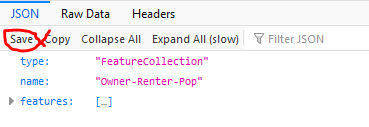
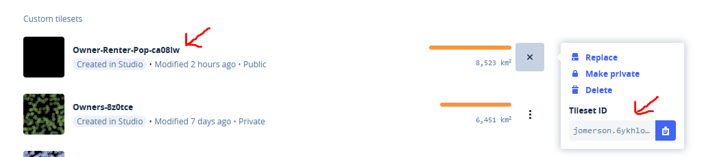

<h2 align="center"> Mapping renters vs owners in Portland </h2>
<h3 align="center"> Part III: Creating a comparative choropleth map </h3>

The US Census makes owner/renter information readily available for census block geometries, in this lab series we are going to view the owner/renter information in different ways: 

1) Mapping the per-person level information, and 
2) Viewing the relative incidence of owners to renters using a choropeth map. 

For this exercise, we will be creating two choropleth maps that display 1) the percentage of owners, and 2) the percentage of renters in Portland, Oregon. We will place one map div directly over another map div and use a Mapbox slider JavaScript Plugin to change which map div is visible.
In the last tutorial we used Studio to dynamically style all of our layers. For this tutorial, we will be writing our styling rules directly the JavaScript in our site. Doing so allows you to control the data symbology in Javascript. This skill is useful for symbolizing data from other sources, or to modify/link your symbology to other actions in your map.
<p align="center">

</p>
  

### In this tutorial you will:

- [Add data](https://www.mapbox.com/help/uploads/){:target="_blank"} to Mapbox as a tileset
- Add JSON data to mabox, as a [tileset](https://docs.mapbox.com/help/glossary/tileset/){:target="_blank"} 
- Add the tileset to a map using Mapbox GJLS
- Add interactivity using a Mapbox plugin to [swipe between maps](https://docs.mapbox.com/mapbox-gl-js/example/mapbox-gl-compare/){:target="_blank"}
- Style your layers using Mapbox GL JS (JavaScript)

----------

### I. Download the data

Download the data below. 
1. Clicking on the link below will take you to a github page showing a JSON file
2. then click *download* or *save* to save it to your computer or R-Drive space (depends on your browser). If your browser tries to just preview the data (a lot of coordinates), you can force it to save: right click on the download button and then click "Save As".

	- [Percentage of renters, owners and total population by block group 2017](Data/Owner-Renter-Pop.geojson){:target="_blank"} - Source: US Census

<p align="center">

</p>
 

----------

### II. Upload data as a tileset to Mapbox

Uploading your data as a tileset, rather than directly to a style, allows you to add it to maps independently from a style. You could add the same tileset to multiple different maps, over different basemap "styles". To add the percentage of renters vs owners data to Mapbox as a tileset, you need to upload it to your account. 

1. Go to your [**Tilesets page**](https://studio.mapbox.com/tilesets/){:target="_blank"} in Mapbox Studio to upload your data.
2. On your Tilesets page, click the **New tileset** button. 
3. From your computer, select the geojson data containing your renters and owners data and upload it to your account. 
4. Once it is uploaded, you should see it listed under the "Custom tilesets". This is your Owner-Renter-Pops tileset that we will refer to later. Notice that it has a unique ID that starts with your username.

	<p align="center">
	  
	</p>


----------

### III. Initializing a map with a swipe


1. To begin, use this sample code created by the documentation team at Mapbox to set up a site with two map divs. Save it in a new `.html` file for this assignment.

	```html
	<!DOCTYPE html>
	<html>
	<head>
	    <meta charset='utf-8' />
	    <title>Swipe between maps</title>
	    <meta name='viewport' content='initial-scale=1,maximum-scale=1,user-scalable=no' />
	    <script src='https://api.tiles.mapbox.com/mapbox-gl-js/v2.2.0/mapbox-gl.js'></script>
	    <link href='https://api.tiles.mapbox.com/mapbox-gl-js/v2.2.0/mapbox-gl.css' rel='stylesheet' />
		
	    <!-- JS and CSS for the swipe plugin -->
	    <script src='https://api.mapbox.com/mapbox-gl-js/plugins/mapbox-gl-compare/v0.4.0/mapbox-gl-compare.js'></script>
	    <link rel='stylesheet' href='https://api.mapbox.com/mapbox-gl-js/plugins/mapbox-gl-compare/v0.4.0/mapbox-gl-compare.css' type='text/css' />
	     <style>
		 body { margin:0; padding:0;overflow: hidden;}
		 body * {
			-webkit-touch-callout: none;
			  -webkit-user-select: none;
			 -moz-user-select: none;
			  -ms-user-select: none;
			      user-select: none;
		     }
		 
		 .map {
			 position: absolute;
			 top: 0;
			 bottom: 0;
			 width: 100%;
		     }
	     </style>
	</head>
	<body>
		<div id="comparison-container">
	     		<div id='owners' class='map'></div>  <!-- div for owners map div -->
	     		<div id='renters' class='map'></div> <!--  div for renters map div -->
     		</div>

		<script>
		  //add your Mapbox access token and map variable here!
		</script>

		</body>
	</html>
	```

2. Notice that in the `<head>` there are script and link tags referencing mapbox-gl-compare JS and  CSS. These are for the Mapbox GL JS [swipe map plugin](https://github.com/mapbox/mapbox-gl-compare).

   **Locate, but don't add again**
	```html
	<!-- JS and CSS for the swipe plugin -->
	<script src='https://api.mapbox.com/mapbox-gl-js/plugins/mapbox-gl-compare/v0.1.0/mapbox-gl-compare.js'></script>
	<link rel='stylesheet' href='https://api.mapbox.com/mapbox-gl-js/plugins/mapbox-gl-compare/v0.1.0/mapbox-gl-compare.css'
	```
      
3. Next, between the `script` tags, where it says "add your Mapbox access token and map variable here", add your Mapbox access token and initialize your owner choropleth by creating a ownerMap variable. This first map will eventually display information about the percentage of homeowners in Portland. 

	```javascript
	mapboxgl.accessToken = 'YOUR ACCESS TOKEN';
	var ownerMap = new mapboxgl.Map({
	    container: 'owners', // owners map div 
	    style: 'mapbox://styles/mapbox/dark-v10', // Mapbox dark style 
	    center: [0, 0], 
	    zoom: 0 
	});
	```

4. Edit the code to add your Mapbox [access token](https://www.mapbox.com/help/define-access-token/){:target="_blank"} in the section that says "ACCESS TOKEN GOES HERE" (get your access token from your Mapbox [‘Account’ page](https://account.mapbox.com/){:target="_blank"}).

	The Mapbox style has already been chosen for you. In this exercise we are using the Mapbox dark style.  

	<p align="center">
	  
	</p>


----------

### IV. Changing the map location and zoom level 

Now that we’ve initialized the webmap, let’s set the appropriate extent. Currently, your map is zoomed out to see the whole world when it loads. We need to change the location and the zoom level. 

1. Locate the line that sets where to center the map view.
2. For practice, change the map center location to the center of the US by finding a coordinate in [google maps](maps.google.com){:target="_blank"} or by placing a marker in [http://geojson.io/](http://geojson.io/#map=2/20.0/0.0){:target="_blank"}.
4. Change the coordinates in your code and preview your changes.
5. Now, change the zoom level to 10, centered on Portland. 
6. Preview your map in a browser to view your changes.

<p align="center">
  
</p>


----------

### V. Add a second map variable 

Below your `ownerMap` variable, initialize your renter map by creating a new variable `renterMap`. This second map will display information about the percentage of renters in Portland. 

```javascript
var renterMap = new mapboxgl.Map({
    container: 'renters', // owners map div 
    style: 'mapbox://styles/mapbox/light-v10', // Mapbox light style so we can observe the swipe
    center: [X,Y],// Use the same center as your other map so that they are perfectly aligned
    zoom: 10 
});
```

Note: in the CSS, both maps have their style set via the shared class "map" or `.map`, so both fill the whole screen. This means that one map will cover the other until we set up the swipe plugin:  

   **Locate, but don't add again**
   
   ```css
	   .map {
		   position: absolute;
		   top: 0;
		   bottom: 0;
		   width: 100%;
	   }
   ```

----------

### VI. Comparing maps
To allow users to compare the two maps by swiping, we can leverage the Mapbox slider JS plugin. A plugin adds functionality using existing complementary JS and CSS. 

1. To do this, add the following JavaScript between the `script` tags, code _after_ your two map variables. Notice it uses the names of the two map variables you already created `ownerMap` and `renterMap`!  
  View [this GitHub repo](https://github.com/mapbox/mapbox-gl-compare){:target="_blank"} for more information about the mapbox-gl-compare plugin.

	```javascript 
	// A selector or reference to HTML element
	var container = '#comparison-container';

	var map = new mapboxgl.Compare(ownerMap, renterMap, container, {
	})
	```

2. Preview your map in a browser to view your changes.
3. So you can see the swipe in action, one uses the light background and one uses the dark background. Since we want the swipe to look seamless, change the style of the renterMap to also use `dark-v10`


<p align="center">
	
</p>


----------
### VII. The load event

What is a callback?

Initializing the map on the page does more than create a container in the map div. It also tells the browser to request the Mapbox Studio style. This can take variable amounts of time depending on how quickly the Mapbox server can respond to that request, and everything else you're going to add in the code relies on that style being loaded onto the map. As such, it's important to make sure the style is loaded before any more code is executed.

Fortunately, the map object can tell your browser about certain events that occur when the map's state changes. One of these events is _load_, which is emitted when the style has been loaded into the map. Through the `map.on` method, you can make sure that none of the rest of your code is executed until that event occurs by placing it in a callback function that is called when the load event occurs.

In summary, to make sure the rest of the JavaScript code can execute, it needs to be placed in a callback function that is executed when the map is finished loading. 

For this exercise you will have two load events, one for your owner map and one for your renter map. 

1. After the ownerMap, add this callback:
    ```javascript 
	ownerMap.on('load', function() {
	  // the rest of the owner data code will go in here
	});
    ```

2. Next, we will add the owner data layer to the map using `ownerMap.addLayer()`. Remember that this goes *inside* of the load function, after the comment `// the rest of the owner data code will go in here`. 


	```javascript
       ownerMap.addLayer({
	 	id: 'Owner Data',
	 	type: "fill",
		 source: {
		   type: 'vector',
		   url: 'mapbox://YOUR TILESET ID'  //input your tileset ID url e.g. 'mapbox://jomerson.6ykhlovc' 
		 },
		   'source-layer': 'YOUR SOURCE LAYER NAME', //input your source layer name e.g. 'Owner-Renter-Pop-ca08iw'
		 paint: {
		   'fill-color': '#cb1515',
		 }

       });
	```

3. Before you can preview your changes, you will need to update this code to use the tileset that is in *your* mapbox account. The steps to do this are detailed below. 

----------
#### VIII. Connecting your tileset 

1. In your Mapbox account, navigate to Studio, then Tilesets, then find your **Owner-Renter-Pops** tileset menu. 

	For each tileset, you can either click on the name of the tileset to go to its information page or click the button  for more options: 

	**Replace**
	Replace the current data in your tileset with new data. The tileset ID will stay the same and the new data will be reflected in all styles that reference this tileset.

	**Delete**
	You can permanently delete a tileset from your account at any time. Deleted tilesets may not be recovered.

	**Tileset ID**
	From this menu, you can also copy the [tileset ID](https://docs.mapbox.com/help/glossary/tileset-id/){:target="_blank"} to be used with Mapbox SDKs and APIs.


2. Copy your tileset ID and add it to your code (be sure to keep the mapbox:// in your tileset ID url):  

	```url: 'mapbox://YOUR ID' //input your tileset ID URL```  
	
	<p align="center">
	
	</p>

3. Next, copy and paste the name of your [source layer](https://docs.mapbox.com/help/glossary/source-layer/){:target="_blank"} into the code. 

4. Preview your map in a browser to view your changes! You should see a vector layer filled with red on one map. 


<p align='center'>
  
  </p>

----------
### IX. Data driven styling 

You can assign a color to each block group based on its field and values. For the first map, we want to create a choropleth map that displays the percentage of the Portland population that owns a home. In order to style by homeownership, you will need to style our data by the "Own" field and to change the "fill-color" parameter of the layer you just added to your map. 

This code is very similar to the process we used in Studio. We are filtering the data from our layer by the data range found in the "Own" field. Each of the five steps is assigned a color and the fill-opacity is set to 0.7. 

1. In the JS, replace the "paint" from red '#cb1515', to stepped blue bins, with an opacity of 0.7, using the following: 

	```javascript
              paint: {
                'fill-color':
                  ["step",
                   ["get", "Own"],
                   "hsl(225, 100%, 97%)",
                   17.0,
                   "hsl(203, 47%, 82%)",
                   22.0,
                   "hsl(202, 57%, 63%)",
                   27.0,
                   "#3182bd",
                   32.0,
                    "hsl(210, 90%, 32%)"
                  ],
                  "fill-opacity": 0.7 
              }       
	 ```


2. Preview your map in a browser to view your changes.

<p align='center'>
  
  </p>
  
----------
### X. Adding a second layer 

Currently, we have only have information for homeowners displayed. To make a meaningful comparison, we will need to add the data symbolized using the renters attribute. We'll add this layer to the other map, so the user can see it when they swipe between maps. 

1. Add a second load event, `renterMap.on('load'...` for the renterMap. Place this function after *end* of the `ownerMap.on` function:

	```javascript 
	renterMap.on('load', function() {
	  // the rest of the renter data code will go in here
	});
	```
   A note on organization. You can organize by declaring both vars first, then both onLoad functions:
	```javascript
	var Owner...
	var Renter...
	Owner.onLoad...
	Renter.onLoad...
	```	
	Or by everything to do with owner, then everything to to with renter:
	```javascript
	var Owner...
	Owner.onLoad...
	var Renter...
	Renter.onLoad...
	```
2. Next, inside this new load function, add your renter data to your renter map as a layer using `renterMap.addLayer`. The tileset ID and the source-layer name will be the _same_ for both layers, since the one dataset has both attributes. We will set a different attribute when styling the data.
   
	```javascript
	renterMap.addLayer({
		 id: 'Renter Data',
		 type: "fill",
		 source: {
		   type: 'vector',
		   url: 'mapbox://YOUR ID' //input your tileset ID URL
		 },
		   'source-layer': 'YOUR SOURCE LAYER NAME', //input your source layer name e.g. Owner-Renter-Pop-dr7310
		 paint: {
		   'fill-color': '#0090f5',
		 }
	});

	```

3. Copy your tileset ID and add it to your code (be sure to keep the mapbox:// in you in your ID URL):  

	```url: 'mapbox://YOUR URL' //input your tileset ID URL```

4. Next, copy and paste the name of your [source layer](https://docs.mapbox.com/help/glossary/source-layer/){:target="_blank"} into the code. 

5. Preview your map in a browser to view your changes. You should see your red vector layer on your second map! 

----------
### XI. Styling your second layer 

For the renter map, we want to create a choropleth map that displays the percentage of the Portland population that rents. In order to style by percentage of renters, you will need to style our data by the 'Rent' field. You will also need to change the 'fill-color' parameter of the layer you just added to your map. 

1. Replace `'#0090f5'` with the following: 
  
   ```javascript
      ["step",
      ["get", "Rent"],
      "hsl(225, 100%, 97%)",
      17.0,
      "hsl(203, 47%, 82%)",
      22.0,
      "hsl(202, 57%, 63%)",
      27.0,
      "#3182bd",
      32.0,
       "hsl(210, 90%, 32%)"],
      "fill-opacity": 0.7          
    ```
 
2. Preview your map in a browser to view your changes.
 
<p align="center">

</p>
  
----------
### XII. Adding a popup that opens on hover

The last step is to add a popup to display the data values. The process is similar to adding popups to markers. To do so, we'll need to initialize a popup variable, and then use JS that interacts with each layer in each map. However, the code below updates the location of the popup to match the user's mouse (or cursor) location any time it moves. It also will automatically close the popup when the mouse leaves the map.


Another note on organization. You should stick with the organization you used earlier. Grouping all variable declarations toegether OR by grouping the owners code and the renter code. What is important, is that the varibale delarations are above the functions that manipulate those variables.

   ```javascript
	//var declarations
	var Owner...
	var Renter...
	var popup = new mapboxgl.Popup...
	
	// map loading functions
	Owner.onLoad...
	Renter.onLoad...
	
	// mouseover functions
	ownerMap.on('mousemove', ...
	renterMap.on('mousemove',...
	
   ```  	
   Or by grouping everything to do with owner, then everything to to with renter:
	
   ```javascript

	var popup = new mapboxgl.Popup...
	// Owner map
	var Owner...
	Owner.onLoad...
	ownerMap.on('mousemove', ...
	
	// Renter map
	var Renter...
	Renter.onLoad...
	renterMap.on('mousemove',...
   ```

1. Add the following code within your `script` section
	```javascript
	// Create a popup, but don't add it to the map yet.
	var popup = new mapboxgl.Popup({
		closeButton: false,
		closeOnClick: false
        });
        
	renterMap.on('mousemove', 'Renter Data', function (e) {
        
            // Change the cursor style as a UI indicator.
            renterMap.getCanvas().style.cursor = 'pointer';
    
            var coordinates = e.lngLat;
            var description = e.features[0].properties.Rent;
    
            // Populate the popup and set its coordinates
            // based on the feature found.
            popup.setLngLat(coordinates)
                .setHTML("Renters: " + description + "%")
                .addTo(renterMap);
        });

        renterMap.on('mouseleave', 'Renter Data', function () {
        	renterMap.getCanvas().style.cursor = '';
        	popup.remove();
        });
	```

2. Use the following for the owner map:

	```javascript
	ownerMap.on('mousemove', 'Owner Data', function (e) {
        
            // Change the cursor style as a UI indicator.
            ownerMap.getCanvas().style.cursor = 'pointer';

            var coordinates = e.lngLat;
            var description = e.features[0].properties.Own;

            // Populate the popup and set its coordinates
            // based on the feature found.
            popup.setLngLat(coordinates)
               .setHTML(" CHANGE THIS " + description + "%")
               .addTo(ownerMap);
        });

        ownerMap.on('mouseleave', 'Owner Data', function () {
            ownerMap.getCanvas().style.cursor = '';
            popup.remove();
        });
	```
3. Change the content of the Owner map popup so that is has a label that makes sense.

 
### Congratulations! You've completed the exercise! 

<p align = "center">
    
</p>

### XIII. Advanced Challenge 

Try adding a legend and a title to your map to make it easier for readers to understand the comparison between owners and renters in Portland. 

To add a legend be sure to add each of the chunks of code:

- The HTML for the legend container `<div class="LegendContainer">... </div>`  You don't have to add a description panel container, but you can if you want it, too.
- The CSS for styling the chunks
- Add the JS for the description panel interaction, if you added it.
- If you add the description panel and want interaction, also add the link to the Bootstrap library in the `head` (See the NOTE in I. Setting up your HTML page)

