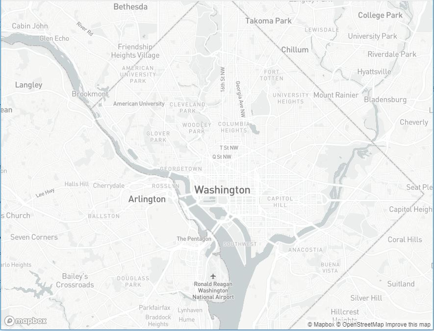
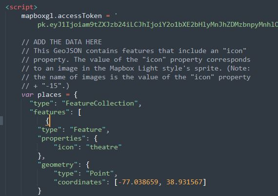
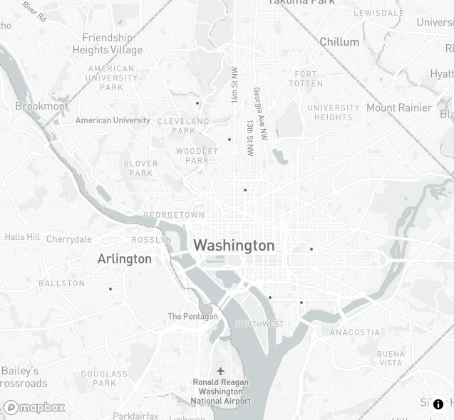
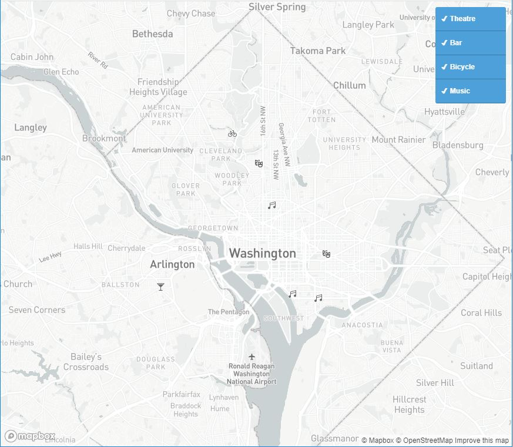
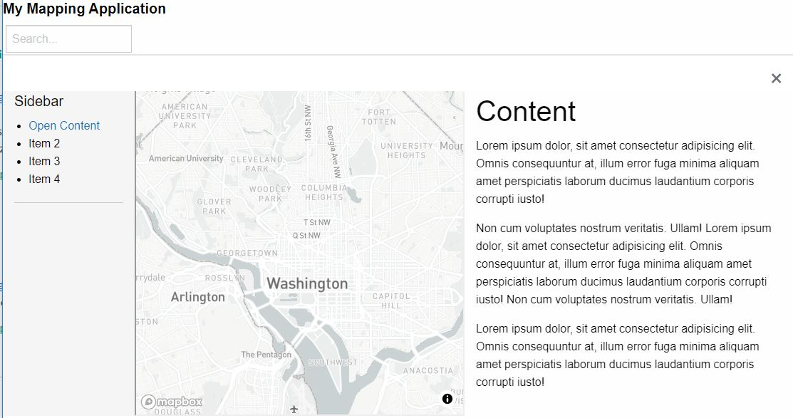

<h2 align="center"> Working with Scale and <br> Putting a mapbox map into an HTML template</h2>

For this exercise, you will be adding GeoJSON format points to a map using Mapbox GLJS, setting some scale dependency, and
You will then add the map an HTML template called "versatile layout".


  Here are some additional resources you can explore:
  - [Maki-icons](https://labs.mapbox.com/maki-icons/){:target="_blank"} 
  - [Mapbox zoom levels](https://docs.mapbox.com/help/glossary/zoom-level/){:target="_blank"}  
  - [Mapbox max bounds](https://docs.mapbox.com/mapbox-gl-js/api/map/#map#setmaxbounds){:target="_blank"} 
  - [W3Schools iframes](https://www.w3schools.com/tags/tag_iframe.asp){:target="_blank"} 
  - [Bootsrap getting started](https://www.w3schools.com/bootstrap4/bootstrap_get_started.asp){:target="_blank"} 

----------

### I. Getting setup  


1. From the course R Drive (R:\Class_Data\Activity5), save the following files to your R drive:
  - filter-markers.html  (the map)
  - VersitileLayout.html  (the website template)
  - VersitileLayout.js (JS for the website)
  - VersitileLayout.css (CSS for the website)

2. 	When you open the map in a browser, `filter-markers.html`, you should have a mapbox-light style centered on Washington DC.  
	<p align="center">
	     
	</p>

----------

### II. Adding the GeoJSON data to the map

1. Copy the GeoSJON data below and paste it into [geoJSON.io](http://geojson.io/){:target="_blank"}  
	```Javascript  
	  {
        "type": "FeatureCollection",
        "features": [
            {
        	"type": "Feature",
        	"properties": {
        	    "icon": "theatre"
        	},
        	"geometry": {
        	    "type": "Point",
        	    "coordinates": [-77.038659, 38.931567]
        	}
            },
            {
        	"type": "Feature",
        	"properties": {
        	    "icon": "theatre"
        	},
        	"geometry": {
        	    "type": "Point",
        	    "coordinates": [-77.003168, 38.894651]
        	}
            },
            {
        	"type": "Feature",
        	"properties": {
        	    "icon": "bar"
        	},
        	"geometry": {
        	    "type": "Point",
        	    "coordinates": [-77.090372, 38.881189]
        	}
            },
            {
        	"type": "Feature",
        	"properties": {
        	    "icon": "bicycle"
        	},
        	"geometry": {
        	    "type": "Point",
        	    "coordinates": [-77.052477, 38.943951]
        	}
            },
            {
        	"type": "Feature",
        	"properties": {
        	    "icon": "music"
        	},
        	"geometry": {
        	    "type": "Point",
        	    "coordinates": [-77.031706, 38.914581]
        	}
            },
            {
        	"type": "Feature",
        	"properties": {
        	    "icon": "music"
        	},
        	"geometry": {
        	    "type": "Point",
        	    "coordinates": [-77.020945, 38.878241]
        	}
            },
            {
        	"type": "Feature",
        	"properties": {
        	    "icon": "music"
        	},
        	"geometry": {
        	    "type": "Point",
        	    "coordinates": [-77.007481, 38.876516]
        	}
            }
        ]
      }
	```   
	  
	Examine the data in the map, in the JSON structure, and in the table view. This GeoJSON contains several features that have an "icon" property. The value of the "icon" property corresponds to an image in the Mapbox Light style's [sprite](https://docs.mapbox.com/help/glossary/sprite/){:target="_blank"}(image). Note: the name of images is the value of the "icon" property + `-15`.
	 
2. In the script section of `filter-markers.html`, add the GeoSJON data structure in a variable called `places` where it says `// ADD THE DATA HERE`, and then set the variable equal to the geoJSON data above (with a semicolon on the end). This just loads data into the variable "places", so you won't see a change in the map.  

	```Javascript  
	    // This GeoJSON contains features that include an "icon"
	    // property. The value of the "icon" property corresponds
	    // to an image in the Mapbox Light style's sprite. (Note:
	    // the name of images is the value of the "icon" property
	    // + "-15".)
	    var places = // put the JSON data here ;
	```  
	
	 It should look something like this:  
	 
 	 <p align="center">
	     
	 </p>  
    
3. To add the data once the map loads, add the following code inside the Map's `On 'load'` function. This 1) defines a Mapbox Source as the data in the `places` var, and specifies that the type is GeoJSON. 2) creates a mapbox Layer of type symbol, from the places Source. Each feature used the icon image `marker-15`
	  
	```Javascript  
	// Add a GeoJSON source containing place coordinates and information.
	map.addSource('places', {
	    'type': 'geojson',
	    'data': places
	});

	// add a new layer using the points
	var layerID = 'points';
	    map.addLayer({
		'id': layerID,
		'type': 'symbol',
		'source': 'places',
		'layout': {
		    'icon-image': 'marker-15',
		    'icon-allow-overlap': true
		},
	});
	```    
  
	The markers should be visible on the map as tiny-little black squares (marker-15).
  
	<p align="center">
		
	</p>
  
4. We are going to change how the data are added. Instead of adding all the points as a single layer, we are going to add each type of point as its own layer. To do that, we will iterate through each record of the data using the `forEach` funtion, and add a new layer if we find a new value in the symbol field. The symbols are from the Style for this map from the [Maki icons](https://labs.mapbox.com/maki-icons/){:target="_blank"}. To add different icon images, you'd need to create your own style and refer to the images as shown in the symbology lab or add imges at runtime via this [add image method](https://docs.mapbox.com/mapbox-gl-js/example/add-image/){:target="_blank"}.

    **Delete or comment out** the following snipit:  
    
    ```Javascript         
	var layerID = 'points';
	map.addLayer({
		'id': layerID,
		'type': 'symbol',
		'source': 'places',
		'layout': {
		    'icon-image': 'marker-15',
		    'icon-allow-overlap': true
		},
	 });
    ```
5. Under `// add a new layer using the points` add the following chunk of code:  
    ```Javascript  
		// add a new layer using the points
		places.features.forEach(function (feature) {
		    var symbol = feature.properties['icon']; // get the value from the 'icon' field in the data
		    var layerID = 'poi-' + symbol;

		    // Add a layer for this symbol type if there is not a layer with this name already.
		    if (!map.getLayer(layerID)) {
			map.addLayer({
			    'id': layerID,
			    'type': 'symbol',
			    'source': 'places',
			    'layout': {
				// These icons are a part of the Mapbox Light style.
				'icon-image': symbol + '-15',
				'icon-allow-overlap': true
			    },
			    // filter the dataset for all features that have the `icon` value that is the same and the current `symbol` value. 
			    'filter': ['==', 'icon', symbol] 
			});

		//                // Add checkbox and label elements for the layer.
		//                var input = document.createElement('input');
		//                input.type = 'checkbox';
		//                input.id = layerID;
		//                input.checked = true;
		//                filterGroup.appendChild(input);

		//                var label = document.createElement('label');
		//                label.setAttribute('for', layerID);
		//                label.textContent = symbol;
		//                filterGroup.appendChild(label);

		//                // When the checkbox changes, update the visibility of the layer.
		//                input.addEventListener('change', function (e) {
		//                    map.setLayoutProperty(
		//                        layerID,
		//                        'visibility',
		//                        e.target.checked ? 'visible' : 'none'
		//                    );
		//                });
			}
		});

	```  
	Refresh your map. Notice the symbols on the map correspond to the `icon` field of each record in the geoJSON dataset.
   
6. To add the legend, we add checkbox and label elements for each layer. 
	Above the script, where the HTML elements are defined, lets add an empty `nav` item with the ID `filter-group`. A nav of navigation item is similar to a `div`, but lets the browser know this contains navigation links, which is useful for accessibility functionality. Read the HTML reference [here](https://www.w3schools.com/tags/tag_nav.asp){:target="_blank"}. Under `<!-- add filter group nav here -->` add the following chunk of code:  
    ```html
	<!-- add filter group nav here -->
	<nav id="filter-group" class="filter-group"></nav>
	```
	
7. To populate the legend, we append checkbox and label elements, for each layer, into the `filter-group` nav. *Uncomment* the following code-block, which is within the `forEach` loop:
	```Javascript
		// Add checkbox and label elements for the layer.
		var input = document.createElement('input');
		input.type = 'checkbox';
		input.id = layerID;
		input.checked = true;
		filterGroup.appendChild(input);

		var label = document.createElement('label');
		label.setAttribute('for', layerID);
		label.textContent = symbol;
		filterGroup.appendChild(label);
    ```
	Notice the checkboxes aren't standard plain HTML checkboxes, and the backgrounds are a pretty blue. This is because the code provided already contains detailed CSS for styling the `.filter-group`. Take a moment to examine the CSS and make an adjustment or two.
	
8. To add interation to the legend, we add a listener to each intupt checkbox. *Uncomment* the following code block:
    ```Javascript
	// When the checkbox changes, update the visibility of the layer.
	input.addEventListener('change', function (e) {
	    map.setLayoutProperty(
		layerID,
		'visibility',
		e.target.checked ? 'visible' : 'none'
	    );
	});
    ```
   
Viola!! An interactive map that filters layers by value!
  <p align="center">
	    
	  </p>
   
<hr>

### III. Adding scale dependency
   
   Find where the map is initialized.  
   
   - Add a min zoom (you pick what the min zoom sould be).  Here is the table of zoom levels: [https://docs.mapbox.com/help/glossary/zoom-level/](https://docs.mapbox.com/help/glossary/zoom-level/){:target="_blank"}  
   - Prevent users from leaving your this bounding around DC by setting the max bounds, per the code block below. 
   	- Add the entire `bounds` variable, and add the `maxBounds` option the the map.	
   - Read about max bounds in the API [https://docs.mapbox.com/mapbox-gl-js/api/map/#map#setmaxbounds](https://docs.mapbox.com/mapbox-gl-js/api/map/#map#setmaxbounds){:target="_blank"}  
   	
  ```Javascript
	// Set bounds to Washington, DC
		var bounds = [
		    [-77.26383, 38.73854], // Southwest coordinates
		    [-76.83569, 39.00114] // Northeast coordinates 
		];

		var map = new mapboxgl.Map({
			container: 'map',
			style: 'mapbox://styles/mapbox/light-v10',
			center: [-77.04, 38.907],
			zoom: 11.15,
			maxBounds: bounds // Sets bounds from variable above
		});
  ```

<hr>
### IV. Add the map to the versitile layout 
	
We are going to go over responsive layouts in class next week, this will get you started on adding your map into an existing template. 
	
1. Open `VersitileLayout.html` in a text editor. Notice that the `CSS` and `JS` for the layout are _not_ directly in `VersitileLayout.html`, but rather are linked via relative paths. Locate the links to the CSS and JS in the `head`.


2. Add the map via an iFrame using the code block below. Read about [iframes](https://www.w3schools.com/tags/tag_iframe.asp).
  Note that this refers to the filter-markers.html (full page map) using a relative path, meaning they must be saved in the same folder. If you used a different name for your map's html file, you'll have to use that file name as the source (src). 
	```html
		<!--  ADD iframe here, inside the versitle layout's map container   -->
         	<iframe src="filter-markers.html" title="Map"></iframe> 
	```

- Change the title so it relates to the map
- Add some desctiptive text about the map to the sidebar 
- Add some descriptive text to the content panel
  	
	<p align="center">
	   
	</p>


	
That is all for today! See the assignment instructions for what to turn in.

<hr>
### V. Extra challenge

1. If you are interested in trying a bootsrap template, check out the templates at [https://www.w3schools.com/bootstrap/bootstrap_theme_me.asp](https://www.w3schools.com/bootstrap/bootstrap_theme_me.asp)  

2. Go through the following sections of the bootstrap 4 tutorial. [https://www.w3schools.com/bootstrap4/bootstrap_get_started.asp](https://www.w3schools.com/bootstrap4/bootstrap_get_started.asp)

3. Read the information provided and click on each of the “Try it yourself!” buttons. 
	Add text here and there to see how it fits in the layout.
	- Get Started
	- Grid Basic
	- Typography
	- Colors
	- Tables
	- Images
	- Buttons
	- Pagination


