<h2 align="center"> Sound and Alt Text</h2>


For this first exercise, we will be adding sound to marker popups in a Mapbox map
  - in popups using an iframe to share a video via absolute link (on the web)
  - in a pupup to share a sound file via a relative location (on your computer)
  - adding alt-text descriptions to images
  

  Here are some additional resources you can explore:
  - [W3Schools iframes](https://www.w3schools.com/tags/tag_iframe.asp){:target="_blank"} 
  - [W3Schools image alt attribute](https://www.w3schools.com/tags/att_img_alt.asp){:target="_blank"} 
  - [W3Schools audio tag](https://www.w3schools.com/tags/tag_audio.asp){:target="_blank"} 

----------

### I. Getting setup  

1. From the course R Drive (R:\Class_Data\Activity6-Sound), downlowd the files to your R drive or local computer. It contains:
  - QickStartMap-withSound.html
  - The folder "Sounds", which contains the file yell-YELLBisonEating150313.mp3 'Source: NPS/Neal Herbert, <a href="https://www.nps.gov/yell/learn/photosmultimedia/sounds-bisoneating.htm">NPS</a>'

2. Review the HTML. Notice it has the standard:
  - `<head> ... </head>` 
  - `<style> ... </style>`   (nested within the head)
  - `<body> ... </body>` 
  - `<script> ... </script>`  (nested within the body

  When you open the map, you should have a mapbox-outdoor style centered on Portland.  
  <p align="center">
    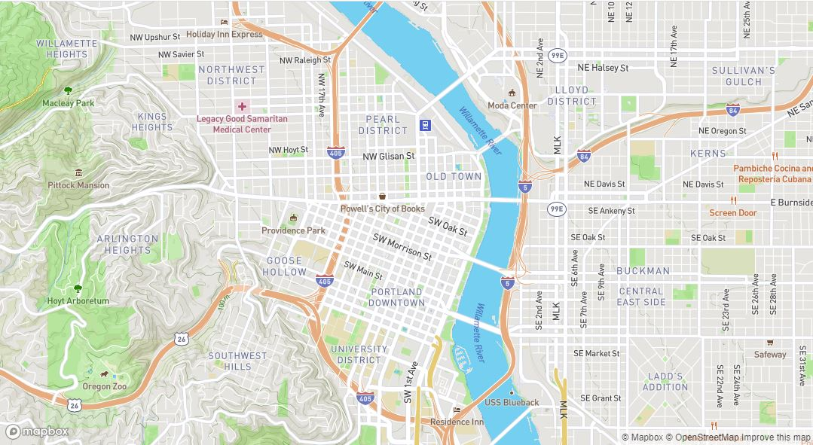 
  </p>

----------

### II. Add 3 markers

Let's start by adding 3 markers. Locate the comment `/***  MARKERS  ***/` then add the code block below. Notice that each marker:
  - was set to the color `darkRed`
  - has a Lng/Lat set
  - then is added to the map with the variable named `map`

  ```javascript
   /***  MARKERS  ***/
      // Marker 1 - Portland
     var marker1 = new mapboxgl.Marker({color:'DarkRed'})
        .setLngLat([-122.6788,45.5212]) // Portland 
        .addTo(map);

        
    // Marker 2 - London 
    var marker2 = new mapboxgl.Marker({color:'DarkRed'})
       .setLngLat([-0.1534307, 51.501223]) // London 
       .addTo(map);

        
    // Marker 3 - Yellowstone
    var marker3 = new mapboxgl.Marker({color:'DarkRed'})
      .setLngLat([-110.74524187568,44.706216445069]) // Yellowstone
      .addTo(map);
    /***  END MARKERS  ***/
  ```

  Zoom way out. You should have 3 markers.  
  <p align="center">
    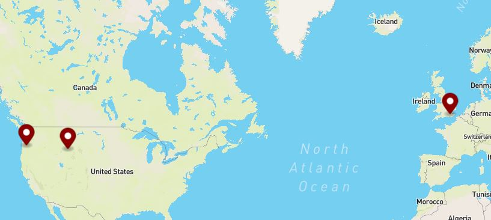 
  </p>
  
----------

### II. Add popups to each marker

1. First we need to initialize three variables `var popup1`, `var popup2`, and `var popup3`. Each is paired with a text-string that will be used for the .setHTML() value `var popup1_content` etc. In the past, we have set the content right within `.setHTML()`, but since the content is going to get pretty long, using a variable let's us stay more organized.  
  Copy in this code block:

   ```javascript
    /***  POPUPS  ***/
        
    // Popup for marker 1  
    var popup1_content = '<h2>Play the video to listen to Portland</h2><br>';
        
    var popup1 = new mapboxgl.Popup({ minWidth:'300px' })
        .setHTML(popup1_content);
       
    // Popup for marker 2  
    var popup2_content = '<h2>Press play to listen to London in 1928</h2><br>';
        
    var popup2 = new mapboxgl.Popup({ minWidth:'300px' })
        .setHTML(popup2_content);

    
    // Popup for marker 3  
    var popup3_content = '<h2>Press play to listen to a bison eating</h2><br>';   
        
    var popup3 = new mapboxgl.Popup({ minWidth:'300px' })
        .setHTML(popup3_content);

   /***  END POPUPS  ***/ 
   ```  
   The popups aren't linked to the markers yet. So, we need to edit the markers so that each is linked to one of the popups.
  

2. Find where marker one is initialized and add `.setPopup(popup1)` on a new line between the .setLngLat and .addTo(map). It will look like this:
   ```javascript
    // Marker 1 - Portland
    var marker1 = new mapboxgl.Marker({color:'DarkRed'})    
      .setLngLat([-122.6788,45.5212]) // Portland 
      .setPopup(popup1) 
      .addTo(map);
   ```

3. Add `.setPopup(popup2)` to marker2 on a new line between `setLngLat` and `.addTo(map)`.
4. Add `.setPopup(popup3)` to marker3.
5. Zoom and pan to each marker and check that the popups open.

  <p align="center">
    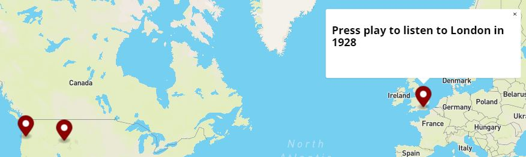 
  </p>

----------

### IV. Embed a YouTube video player in popup 1

To embed a YouTube Video, we can add an iframe to the HTML content of `popup1_content`. To help keep our code organized we can concatenate or "join together" multiple text strings. We will use `+=` to append more html text to the end of the existing variable.  
We can concatenate strings with a plus sign:
   ```javascript
   // the long way
   var x = "Hello";
   x = x + " World";
   ```
   x now equals "Hello World".
   OR
   ```javascript
   // using += as shorthand
   var x = "Hello";
   x += " World";
   ```
 x now equals "Hello World".
 
 Let's try with the popup content:

1. Locate the popup for marker 1 and use += to append the iframe embed code from https://www.youtube.com/embed/z1AdmS-LqyA 

   ```javascript
    // Popup for marker 1  
    var popup1_content = '<h2>Play the video to listen to Portland</h2><br>';
    popup1_content += '<iframe width="300px" src="https://www.youtube.com/embed/z1AdmS-LqyA" frameborder="0" allow="accelerometer; autoplay; encrypted-media; gyroscope; picture-in-picture" allowfullscreen></iframe>';
   ```
     The Portland popup should now look like this.
     <p align="center">
    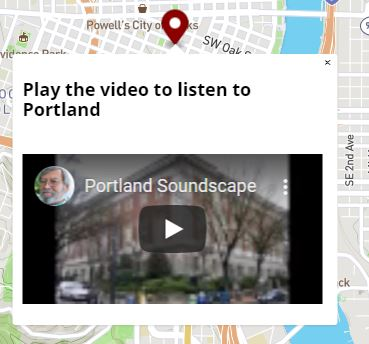 
    </p>

2. Let's also add the source and a link ```popup1_content += 'Source: Ian Lind, <a href="https://www.youtube.com/embed/z1AdmS-LqyA">YouTube</a>';```

      ```javascript
    // Popup for marker 1  
    var popup1_content = '<h2>Play the video to listen to Portland</h2><br>';
    popup1_content += '<iframe width="300px" src="https://www.youtube.com/embed/z1AdmS-LqyA" frameborder="0" allow="accelerometer; autoplay; encrypted-media; gyroscope; picture-in-picture" allowfullscreen></iframe>';
    popup1_content += 'Source: Ian Lind, <a href="https://www.youtube.com/embed/z1AdmS-LqyA">YouTube</a>';
   ```
    <p align="center">
    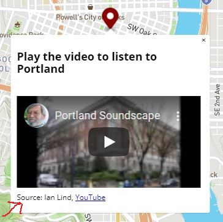 
    </p>

----------

### V. Embed a Soundcloud player in popup 2


1. To make it easier to see your changes, set the map's initial center to the same location as the London popup.
2. Locate the popup for marker 2 `popup2_content` and use += to append the iframe embed code from https://soundcloud.com/londonstreetnoises/grosvenor-1928 `popup2_content`
3. Click the share button, then `Embed`, then copy the code.
    <p align="center">
    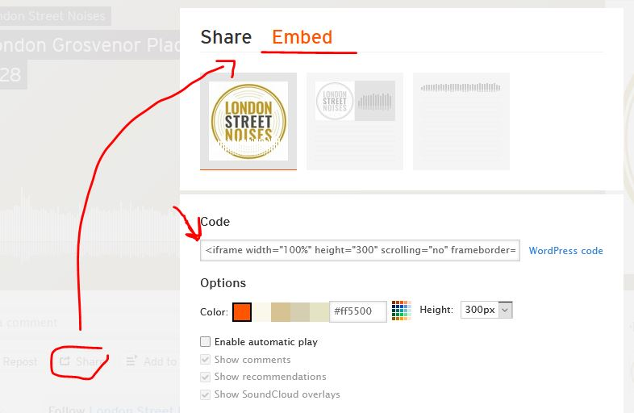 
    </p>
    
    It's going to be rather long and look like the image below. Take a look at the HTML code and see what HTML tags you can recognize.
    <p align="center">
    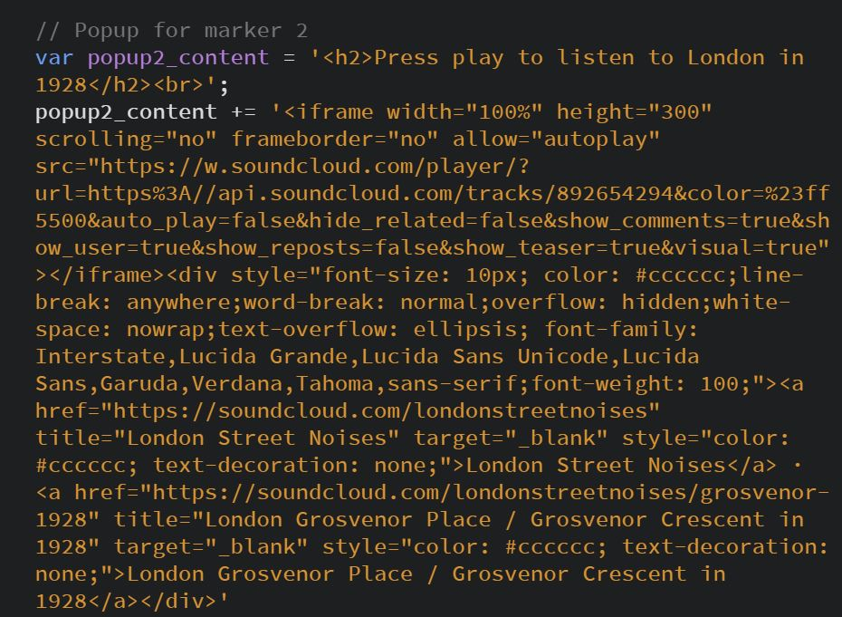 
    </p>
    
4. Lastly, let's also add the source and a link using an anchor tag ```popup2_content += 'Source: LondonStreetNoises.co.uk, <a href="https://soundcloud.com/londonstreetnoises"> SoundCloud </a>';```


    <p align="center">
    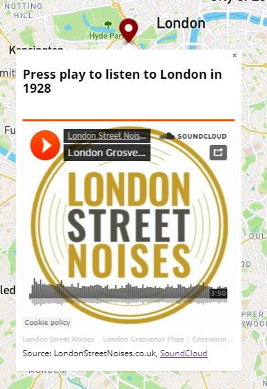 
    </p>


----------

### VI. Embed a sound file using an html audio player in popup 3
Now let's add a sound file from a relative location (one that you have stored on your computer).  The National Park Service has a whole library of sounds that you can download: https://www.nps.gov/yell/learn/photosmultimedia/soundlibrary.htm. "They may be downloaded and used without limitation; however, please credit the "National Park Service " where appropriate".  

The sound file you downloaded from the R drive is a recording a bison eating `yell-YELLBisonEating150313.mp3`. Have a listen to it using the default audio player on your computer.

1. To make it easier to see your changes, set the map's inital center to the same location as the Yellowstone popup.
2. Locate the popup for marker 3 `popup3_content` 
3. Append a string containing an [HTML audio tag](https://www.w3schools.com/tags/tag_audio.asp){:target="_blank"} .
    ```javascript
    popup3_content += '<audio controls><source src="PATH_TO_FILE" type="audio/mpeg">Your browser does not support the audio element.</audio>';
    ```
4. Replace the `PATH_TO_FILE` with the path to the file _relative_ to this webpage. If it's in the sounds folder, it is going to be `sounds/yell-YELLBisonEating150313.mp3`
   ```javascript
   // Popup for marker 3  
    var popup3_content = '<h2>Press play to listen to a bison eating</h2><br>';   
    popup3_content += '<audio controls><source src="sounds/yell-YELLBisonEating150313.mp3" type="audio/mpeg">Your browser does not support the audio element.</audio>';
    ```
     
5. And of course, let's add linked attribution ```popup3_content += 'Source: NPS/Jennifer Jerret, <a href="https://www.nps.gov/yell/learn/photosmultimedia/sounds-bisoneating.htm">NPS</a>';```

    <p align="center">
    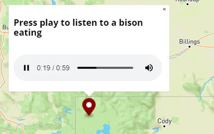 
    </p>


----------

### VII. Add an absolute link to a image to popup3 file
The audio file of the bison eating is great, but it could use a visual. Let's add the image that the NPS used at https://www.nps.gov/yell/learn/photosmultimedia/sounds-bisoneating.htm. We can use an img tag and set the src to the image URL.

1. Visit the bison sounds clip at https://www.nps.gov/yell/learn/photosmultimedia/sounds-bisoneating.htm and right click on the image > copy image link
   <p align="center">
    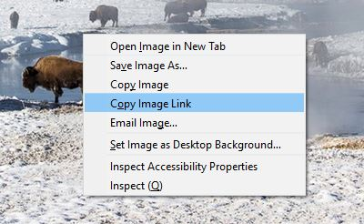 
    </p>
2. Paste the link into the browser. TADA! We can use this URL as the absolute path to this image.
3. Append an HTML img tag to `popup3_content`
   ```javascript
   popup3_content += '' ;
   ```
   Note 1: `` is a self closing tag, so we don't need a second tag to close it.
4. Replace the `PATH_TO_FILE` with the bison image link `https://www.nps.gov/yell/learn/photosmultimedia/images/ndh-yell-bison-gibbon_2.jpg?maxwidth=1200&maxheight=1200&autorotate=false`
5. Is the image way too big for the popup? Let use CSS to set it's width to 100% of the parent element. We already gave it a class named `popupImage`, so add the following to the `<style>` section in the `<head>`. 
   ```css
   .popupImage{
       width:100%;
    }
   ``` 
 
6. Let's add more attribution. On the next line, add:
   ```javascript
    popup3_content += 'Source: NPS/Neal Herbert, <a href="https://www.nps.gov/yell/learn/photosmultimedia/sounds-bisoneating.htm">NPS</a>';
   ```

 <p align="center">
    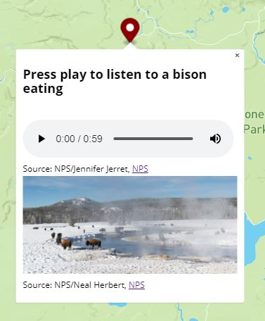 
    </p>


----------

### VIII. Add alt text to the image
To add a little more accessibility to our page, we should add text that screen readers can read adding an alternate or "alt" attribute to our image tag.

1. Review the HTML reference for the `alt` attribute of an `` tag: https://www.w3schools.com/tags/att_img_alt.asp
2. In the img tag add `alt="Description of photo"`, and add your own description of the scene. 
   Here is what I wrote:
   
 <p align="center">
    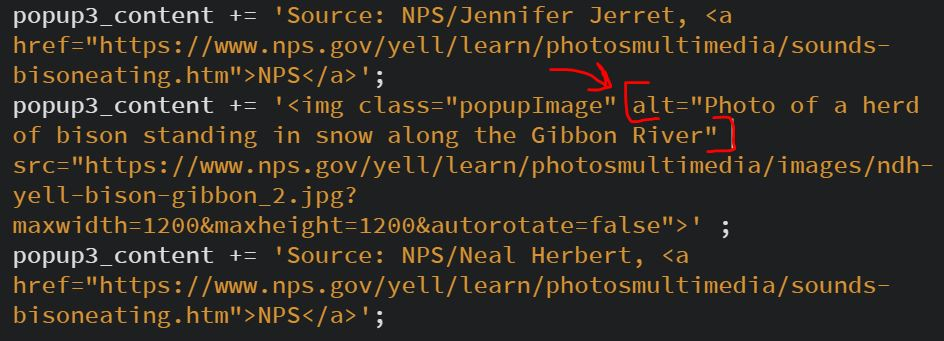 
    </p>

----------

### IX. Add buttons to jump to each location

Now let's add some UI to make it easier to get to each location.

1. Near the top of the `<body>` we can add three buttons. One for each marker:
   ```html
      <button class='fly' id='PortlandButton'>Jump to Portland</button>
      <button class='fly' id='LondonButton'>Jump to London</button>
      <button class='fly' id='YellowstonButton'>Jump to Yellowstone</button> 
   ```
   These are all styled by the `.fly` class which was already added.
    <p align="center">
    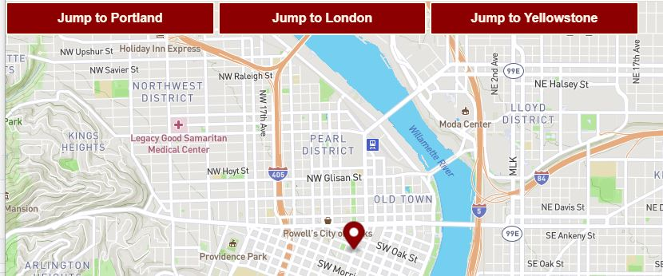 
    </p>
2.  The buttons don't actually do anything until we add JavaScript "click" listeners to each button, and within the scope of the listener, we can use a `map.JumpTo` function to change the map view. Here are the first 2:
   ```javascript
    /***  LISTENERS  ***/
        
    // Add a 'Listener' to the div with the ID 'LondonButton', that's the button.
    document.getElementById('LondonButton').addEventListener('click', function () {
            map.jumpTo({
                center: [-0.1534307, 51.501223], 
                zoom: 11
            });
    });
        
    // Add a 'Listener' to the div with the ID 'PortlandButton', that's the button.
    document.getElementById('PortlandButton').addEventListener('click', function () {
            map.jumpTo({
                center:[-122.6788,45.5212], 
                zoom: 9
            });
    });
        
    /***  END LISTENERS  ***/
   ```
   
3. Add a listener for the div with the ID 'YellowstonButton', that's the button. Use the same center as the marker and a zoom level of 9.
  
----------

Try all 3 buttons, open all 3 popups, lisen to all 3 recordings. Does everything work?

<p align="center">
      
    </p>
----------    
### What to turn in:

1. Complete all the steps above
  Be sure to:
    - Embed the soundcloud player
    - Add your own descriptive text to the image's alt tag
    - Add a listener for the Yellowstone button
2. Make 1 change to the map (if you change the marker color(s), make sure to change the buttons' color(s) to match.
3. Add the HTML script and image (with the same folder structure) to your Pages space
4. Answer the questions in the submission
 
